# 🏗️ WinTokenMon — Architecture Documentation

> **Language / Bahasa**: [**English**](ARCHITECTURE.md) | [**Bahasa Indonesia**](id/ARCHITECTURE.id.md)

This document provides a comprehensive technical breakdown of the architecture, design patterns, subsystems, and data flows in **WinTokenMon**.

---

## 1. High-Level Architecture Diagram

```mermaid
flowchart TD
    subgraph "Local Storage / AI Tools"
        AG["Antigravity CLI<br/>~/.gemini/.../*.db"]
        CL["Claude Code<br/>~/.claude/projects/**/*.jsonl"]
        CR["Cursor IDE<br/>%APPDATA%/Cursor/.../state.vscdb"]
        CX["Codex CLI<br/>~/.codex/sessions/**/rollout-*.jsonl"]
        CP["GitHub Copilot CLI<br/>~/.copilot/session-store.db"]
        KM["Koma (aula-id/koma)<br/>~/.koma/sessions/*.json & ledger/"]
    end

    subgraph "Core Ingestion & Game Engine"
        TR["WindowsTokenReader<br/>(core/token_reader.py)<br/>• Incremental Tail Scanning (seek_pos)<br/>• O(1) Stat Cache (thread-safe)<br/>• Cache Eviction & Caps"]
        CS["CompanionStore<br/>(core/companion_store.py)<br/>• Atomic Save (.tmp + os.replace) + .bak<br/>• Corrupt-State Quarantine & Recovery<br/>• Loaded-Value Clamping<br/>• O(1) SPECIES_INDEX Lookups<br/>• Evolution & Level Mechanics"]
        AM["AudioManager<br/>(core/audio_manager.py)<br/>• Lazy Mixer Init & Synth Caching<br/>• Threaded Playback<br/>• PokeAPI Cry Cache + Cooldown"]
        AE["AnimationEngine<br/>(core/animation_engine.py)<br/>• Damped Sine Bounce<br/>• Floating Emoji Easing<br/>• White Flash & Sparkles<br/>• Egg Wobble Oscillation"]
    end

    subgraph "Platform Services"
        UP["UpdateChecker<br/>(core/updater.py)<br/>• 24h Cooldown-Aware Release Check<br/>• SHA256-Verified Installer Download<br/>• Persisted Prefs via state.json"]
        LOG["AppLog<br/>(core/applog.py)<br/>• APPDATA Log File w/ Rotation<br/>• log_once Anti-Spam Helper"]
        AS["AutostartManager<br/>(core/autostart.py)<br/>• HKCU Run Key Registry"]
    end

    subgraph "Presentation Layer"
        APP["WinTokenMonApp (main.py)<br/>• Scanner Worker Thread + UI Queue Pump<br/>• @tk_safe Error Boundary<br/>• Main Thread Tkinter Loop"]
        PET["DesktopPetWindow<br/>(ui/desktop_pet.py)<br/>• Frameless Transparent Tkinter<br/>• Change-Detection Frame Skipping<br/>• Sleep Mode & Burn Badge<br/>• Animated Sprite Renderer"]
        STARTER["StarterSelectionModal<br/>(ui/starter_modal.py)<br/>• Gen 1-9 Grid Selector<br/>• Animated Preview & Type Tags"]
        TRAY["SystemTrayManager<br/>(ui/system_tray.py)<br/>• Pystray Background Thread<br/>• Windows Native Toasts"]

        subgraph "Modular Dashboard (ui/)"
            DASH["DashboardWindow (ui/dashboard.py)<br/>• Coordinator & Lazy Tabview<br/>• In-Memory Sprite Cache<br/>• Animated Toast System"]
            THEME["Theme & Lore (ui/dashboard_theme.py)<br/>• TYPE_THEMES & POKEMON_LORE"]

            subgraph "Tabs (ui/tabs/)"
                T_HOME["HomeTabView (home_tab.py)<br/>• Companion EXP & 7-Day Chart"]
                T_DEX["PokedexTabView (pokedex_tab.py)<br/>• Pokédex Grid & Catch Log Dual-View"]
                T_SHOP["ShopTabView (shop_tab.py)<br/>• Incubator Hub & Bag Items"]
                T_SET["SettingsTabView (settings_tab.py)<br/>• Limit Alerts, Providers & Update Toggle"]
            end

            subgraph "Modals (ui/modals/)"
                M_NAT["NatureSelectorModal (nature_modal.py)"]
                M_INSP["PokedexInspectorModal (pokedex_inspector_modal.py)"]
                M_EVO["EvolutionModal (evolution_modal.py)"]
                M_UPD["UpdateAvailableModal (update_modal.py)"]
            end
        end
    end

    AG & CL & CR & CX & CP & KM --> TR
    TR -->|Token Usage Summary & Deltas| APP
    APP -->|"add_tokens(delta)"| CS
    APP -->|poll updates| PET & DASH & TRAY
    APP -->|first launch wizard| STARTER
    STARTER -->|"choose_starter(species_id)"| CS
    CS -->|Emit Ceremony Events| PET
    CS -->|Threshold Alerts| TRAY
    PET -->|Ceremony & Click SFX| AM
    PET -->|Visual Feedback| AE
    APP -->|daily background check| UP
    UP -->|update available| APP
    UP -->|read/write update prefs| CS
    UP -.->|GitHub Releases API| GH[("api.github.com")]
    AM & TR & UP -.->|sprite/cry fetches| NET[("raw.githubusercontent.com")]
    DASH --> T_HOME & T_DEX & T_SHOP & T_SET
    DASH --> M_NAT & M_INSP & M_EVO & M_UPD
    T_HOME & T_DEX --> THEME
```



---

## 2. Subsystem Breakdowns

### A. Multi-Provider Token Ingestion ([`core/token_reader.py`](../core/token_reader.py))
- **Antigravity CLI**: Scans `~/.gemini/antigravity-cli/conversations/*.db`. Extracts binary protobuf records from `gen_metadata.data` (`field 2`: input tokens, `field 3`: output tokens, `field 4`: cache write, `field 5`: cache read, `field 9.4.1`: timestamp).
- **Claude Code**: Recursively reads `~/.claude/projects/**/*.jsonl` parsing tool usage entries (`message.usage`).
- **Cursor IDE**: Reads `%APPDATA%\Cursor\User\globalStorage\state.vscdb` in `mode=ro` URI mode, parsing `bubbleId:*` and `composerData:*` conversation JSON blobs from table `cursorDiskKV`.
- **Codex CLI**: Parses `~/.codex/sessions/**/rollout-*.jsonl` for `payload.type == "token_count"` records.
- **GitHub Copilot CLI**: Reads `~/.copilot/session-store.db` querying `assistant_usage_events`.
- **Koma**: Parses `~/.koma/sessions/*.json` and `~/.koma/ledger/*.jsonl` for session token usage.
- **Incremental Tail Scanning & Caching**:
  - Maintains an in-memory file cache `path -> (mtime, seek_pos, entries)`.
  - On appending log files, executes `f.seek(cached_seek_pos)` to parse only newly added lines in $O(\Delta)$ time instead of re-parsing massive JSONL logs from byte 0, reducing background CPU load by >85%.

---

### B. Game State & Economy Engine ([`core/companion_store.py`](../core/companion_store.py))
- **State File**: `%APPDATA%\WinTokenMon\state.json`.
- **Precomputed `SPECIES_INDEX`**: Instant $O(1)$ dictionary lookups (`SPECIES_INDEX: dict[int, dict]`) mapping each Pokémon species ID directly to its evolution line metadata, eliminating repeated $O(N)$ linear scans.
- **Throttled Disk Saves**: `record_daily_tokens()` avoids rewriting `state.json` when today's token count is unchanged, preventing unnecessary disk wear during idle intervals.
- **Dynamic Pokédex & Catch Log Aggregation**:
  - `get_dex_species()` aggregates uniquely owned species dynamically from captured logs and active companion chains.
  - Full chronological `catch_log` records timestamps, natures, rarities, and token EXP spent.
- **Tiered Egg Hatching**:
  - `Standard Starter Egg`: 2.5M tokens.
  - `Uncommon Egg`: 6M tokens.
  - `Rare Egg`: 15M tokens.
  - `Legendary Egg`: 35M tokens.
- **Stage Progression Formula**:
  For an evolution line with $k$ total stages and current stage index $i$ (1-indexed):
  $$\text{Stage Threshold} = \text{round}\left( \text{Graduation Total}(\text{Rarity}) \times \frac{i}{k(k+1)/2} \right)$$
- **Ceremony Event Queue**: Emits decoupled `@dataclass CeremonyEvent` payloads (`hatch`, `evolve`, `graduate`, `candy_xp`, `mint_change`) consumed and played by the UI.

---

### C. Desktop Pet Presentation Subsystem ([`ui/desktop_pet.py`](../ui/desktop_pet.py))
- **Transparency on Windows**: Achieved via Tkinter colorkey transparent overlay:
  ```python
  self.root.config(bg="#000001")
  self.root.wm_attributes("-transparentcolor", "#000001")
  ```
- **Click vs. Drag Protocol**:
  - On mouse press, anchors coordinates.
  - On mouse motion, if displacement exceeds 4px, locks into dragging state and moves the window.
  - On release without drag motion, triggers interactive spring bounce and emoji reaction.
- **Idle / Sleep State Machine**:
  - Tracks timestamp of last token delta.
  - After 20 minutes without token delta, renders floating `💤` emoji.
  - Wakes up immediately upon any user click or new token arrival.
- **Coding Burst State**:
  - Activates when $>500\text{k}$ tokens are received within a 10s window, rendering an animated `🔥` indicator.

---

### D. Audio & SFX Subsystem ([`core/audio_manager.py`](../core/audio_manager.py))
- **Threaded Playback**: Pygame mixer operations are executed in dedicated daemon threads to prevent any audio latency from freezing the Tkinter GUI thread.
- **Dynamic PokeAPI Cry Downloader**: Automatically resolves `.ogg` cry files from `PokeAPI/cries` repository and caches locally in `%APPDATA%\WinTokenMon\cries\`.
- **Chiptune Level-Up Synthesizer**: Generates in-memory 8-bit square-wave level-up arpeggios ($C_5 \to E_5 \to G_5 \to C_6 \to E_6 \to G_6$) with exponential decay, guaranteeing sound playback even with zero bundled audio files.

---

### E. Modular Dashboard Architecture ([`ui/dashboard.py`](../ui/dashboard.py), [`ui/tabs/`](../ui/tabs/), [`ui/modals/`](../ui/modals/))
- **Window Coordinator (`ui/dashboard.py`)**: Ramping coordinator (< 200 lines) handling the top-level window, In-App Toast system, and In-Memory Sprite Image Cache (`_sprite_cache`).
- **Lazy Tab Loading**: Only the Home HUD tab is initialized on window launch (< 0.05s startup). Subsequent tabs (`Pokédex`, `Shop`, `Settings`) are instantiated upon first click.
- **Modular Tab Controllers (`ui/tabs/`)**:
  - **`home_tab.py`**: Trainer HUD ribbon, active companion card, dynamic elemental color theming, per-tool AI breakdown, and 7-day token burn history bar chart.
  - **`pokedex_tab.py`**: Reference-style dynamic Pokédex grid, dual-mode Catch Log switcher, empty-state mascots, live search, and rarity filtering.
  - **`shop_tab.py`**: Spendable token currency, egg incubator adoption, Rare Candies, Nature Mints, and Shiny Charms.
  - **`settings_tab.py`**: Daily token budget limits with toast alerts, pet size presets, opacity slider, audio toggles, and autonomous roaming controls.
  - **Modal Controllers (`ui/modals/`)**:
    - **`nature_modal.py`**: Interactive 20-personality Nature Mint selector.
    - **`pokedex_inspector_modal.py`**: Detailed Pokémon inspector displaying cry sound playback, bio lore, evolution lines, and the "Set as Active Companion" trigger.
    - **`evolution_modal.py`**: Cinematic Game-Boy-style morph animation with particle bursts, silhouette flashing, and cry fanfares.
    - **`update_modal.py`**: Update-available dialog with changelog preview, one-click SHA256-verified download, and *Skip This Version*.

---

### F. Configuration Layering & Environment Architecture
WinTokenMon uses a two-tier configuration model to separate persistent user state from developer testing:
1. **Production / User State (`%APPDATA%/WinTokenMon/state.json`)**:
   - Single source of truth for companion levels, inventory items, Pokédex captures, update preferences, and user settings.
   - **Atomic writes** (`state.json.tmp` → `os.replace`) with a rolling `.bak` of the last known-good state.
   - Corrupt files are quarantined as `state.corrupt-<timestamp>.json` and the loader falls back to the backup — a crash can never wipe progression.
   - Preserved across app restarts and installer upgrades.
2. **Developer Environment Flags (real environment variables)**:
   - `WINTOKENMON_DEBUG`: Enables verbose debug output to stdout/stderr.
   - `WINTOKENMON_POLL_INTERVAL`: Overrides background scanning cycle frequency.

---

### G. Packaging & Modern Python Toolchain
- **PEP 621 Standard**: All package metadata, runtime dependencies, optional dev dependencies, and tool settings are centralized in [`pyproject.toml`](../pyproject.toml).
- **Fast Environment Management with `uv`**: Uses Astral's `uv` for reproducible, lightning-fast virtual environments and lockfile generation (`uv.lock`).
- **Zero-Friction Code Quality with `Ruff`**: Fast Rust-based linter and code formatter configured to eliminate bugs and enforce clean import sorting.
- **Windows Standalone Packaging**: Standalone single-file executables bundled via PyInstaller and system installer via Inno Setup (`installer.iss`). The installer version is injected at compile time (`/DMyAppVersion=<core.__version__>`) so the wizard can never package a stale binary; CI additionally publishes SHA256 checksums for every release artifact.

---

### H. Auto-Updater & Observability Subsystem ([`core/updater.py`](../core/updater.py), [`core/applog.py`](../core/applog.py))
- **UpdateChecker (`core/updater.py`)**:
  - Queries the GitHub Releases API on a daemon worker thread — never blocks the UI loop.
  - Daily cadence enforced via `last_update_check_time` persisted in `state.json`; network failures enter a short session retry cooldown.
  - Honors two user preferences also persisted in state: `auto_check_updates_enabled` and `skipped_update_version`.
  - Downloads the Inno Setup installer to `%TEMP%`, verifies its SHA256 against the published checksum before launching it silently.
- **AppLog (`core/applog.py`)**:
  - File logger at `%APPDATA%/WinTokenMon/logs/wintokenmon.log` with size-based rotation.
  - `log_once(key, msg)` helper records recurring background failures exactly once per session to keep the log readable.
- **Wiring (`main.py`)**: scanner results and updater events are marshalled to the Tk main thread through small queues; all UI mutations stay on one thread while disk/network I/O lives on daemons.

---

## 3. Extensibility & Future Architecture

The v0.2.0–v1.0.0 roadmap (Achievements Engine, Interactive Feeding, Compact HUD, Extended Scanners, Auto-Updater) has been fully implemented and is documented in the subsystems above.

For exploratory designs of far-future features — most notably the **Retro Battle Arena & Stat Engine RFC** (EV/IV stats, damage formulas, PvE/local-LAN battles) — please see the [Future Works & Roadmap Blueprint](FUTURE-WORKS.md).

For known platform boundaries and technical workarounds regarding Windows Tkinter transparency, multi-monitor DPI, and exclusive fullscreen apps, please consult [Known Limitations & Platform Quirks](KNOWN-LIMITATIONS.md).
