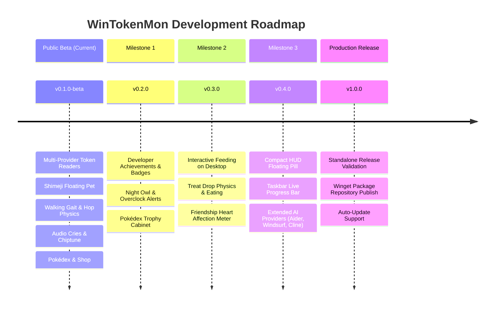
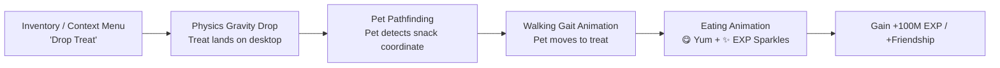

# 🗺️ Roadmap & Future Works: WinTokenMon

> **Language / Bahasa**: [**English**](FUTURE-WORKS.md) | [**Bahasa Indonesia**](id/FUTURE-WORKS.id.md)

This document outlines the roadmap overview. For detailed, production-grade architectural RFCs with data schemas, failure modes, and test strategies, see the [**Implementation Plans Directory (`docs/plans/`)**](plans/README.md).

---

## 🧭 Milestone Overview



---

## 🏆 1. Developer Achievements & Badges System (`v0.2.0`)
> 📑 **Detailed RFC Plan**: [**`docs/plans/v0.2.0-developer-achievements-and-badges.md`**](plans/v0.2.0-developer-achievements-and-badges.md)

### Overview
A gamified achievement framework that rewards developers for real-world coding habits, multi-tool workflows, and long-term milestones.

### Planned Achievement Badges

| Badge | Title | Condition / Trigger | Reward |
| :--- | :--- | :--- | :--- |
| 🦉 | **Night Owl Coder** | Consume $>100\text{k}$ tokens between 00:00 and 05:00 local time | 🪙 5M Spendable Tokens |
| ⚡ | **Token Overclock** | Burn $>1\text{M}$ tokens within a single 60-minute window | 🍬 1x Rare Candy |
| 🐣 | **First Hatch** | Hatch your very first Pokémon companion egg | 🪙 10M Spendable Tokens |
| ✨ | **Shiny Hunter** | Hatch a rare Shiny Pokémon variant (1/129 or 1/40 odds) | ✨ 1x Shiny Charm |
| 🧙‍♂️ | **Multi-Tool Wizard** | Burn tokens across 3+ different AI tools in a single day | 🌿 2x Nature Mints |
| 💯 | **100M Burn Club** | Accumulate $100\text{M}$ total lifetime burned tokens | 🏅 Gold Profile Badge |
| 🎓 | **Senior Professor** | Graduate 5 Pokémon companions to Senior status | 🍬 5x Rare Candies |
| 🥚 | **Egg Hoarder** | Purchase every Egg Tier (Standard, Uncommon, Rare, Legendary) | 🪙 50M Spendable Tokens |

### Architecture & Data Schema
```python
# Planned Achievement Data Model
class Achievement:
    id: str  # e.g. "night_owl"
    name: str  # e.g. "Night Owl Coder"
    description: str  # e.g. "Burned >100k tokens after midnight"
    icon_emoji: str  # "🦉"
    unlocked_at: Optional[float]
    progress: float  # 0.0 to 1.0
    reward_tokens: int
    reward_item: Optional[str]
```
- **Trigger Hooks**: Evaluated inside `WindowsTokenReader.get_summary()` and `CompanionStore.add_tokens()`.
- **Celebration UX**: Displays native Windows Toast notification (*"🎖️ Achievement Unlocked: Night Owl Coder!"*) and awards badge in the Dashboard trophy cabinet.

---

## 🎈 2. Interactive Desktop Minigames & Direct Feeding (`v0.3.0`)
> 📑 **Detailed RFC Plan**: [**`docs/plans/v0.3.0-interactive-feeding-and-friendship.md`**](plans/v0.3.0-interactive-feeding-and-friendship.md)

### Overview
Bring the desktop companion to life with direct physics-based screen interactions, feeding treats, and friendship affection mechanics.

### Planned Mechanics:
1. **Direct Treat Dropping**:
   - In the Inventory tab or via pet right-click context menu, click *"Drop Rare Candy"* or *"Drop Berry"*.
   - A tiny snack icon falls onto the Windows desktop floor with realistic gravity bounce.
   - The Pokémon detects the snack, rotates towards it, walks over with its walking gait, and plays an eating animation (`😋` / `✨`).
2. **Petting & Affection (Friendship Meter)**:
   - Clicking and gently moving the cursor over the Pokémon rubs/pets it.
   - Generates rising heart particles (`💖`) and fills a daily **Friendship Bar** ($0 \to 100\%$).
   - High friendship unlocks exclusive companion reaction animations (happy backflips, nap poses, and special cries).



---

## 📊 3. Ultra-Compact Floating HUD & Extended AI Providers (`v0.4.0`)
> 📑 **Detailed RFC Plan**: [**`docs/plans/v0.4.0-extended-ai-scanners-and-compact-hud.md`**](plans/v0.4.0-extended-ai-scanners-and-compact-hud.md)

### Overview
For power users who prefer minimal screen clutter while keeping an eye on live token burn velocity and incubation progress, alongside auto-detecting newer AI developer tools.

### Visual Mockup:
```
┌──────────────────────────────────────────────────────────┐
│  🔥 142.5k / 2.5M (5.7%)  │  🪙 12.4M  │  🍬 x3  │  [⚙️]  │
└──────────────────────────────────────────────────────────┘
```

### Planned AI Providers:
| Provider | Target Path (Windows) | Data Format |
| :--- | :--- | :--- |
| **Aider** | `~/.aider.chat.history.md` / `.aider.tags.cache.v3` | Markdown metadata / JSON tokens |
| **Windsurf / Cascade** | `%APPDATA%\Windsurf\User\workspaceStorage\*\state.vscdb` | SQLite `mode=ro` |
| **Roo Code / Roo Cline** | `%APPDATA%\Code\User\globalStorage\rooveterinaryinc.roo-cline\` | JSON session history |
| **Cline (VS Code)** | `%APPDATA%\Code\User\globalStorage\saoudrizwan.claude-dev\` | JSON session logs |

---

## 📦 4. Production Release & Distribution (`v1.0.0`)
> 📑 **Detailed RFC Plan**: [**`docs/plans/v1.0.0-production-release-and-winget.md`**](plans/v1.0.0-production-release-and-winget.md)

1. **Automated Release Validation**:
   - Automated PyInstaller standalone single-file binary tests on clean virtual machines.
   - Inno Setup installer uninstallation cleanliness tests.
2. **Windows Package Manager (Winget)**:
   - Automated submission of manifests from [`winget/`](../winget/) to `microsoft/winget-pkgs`.
   - Single-line terminal installation: `winget install WinTokenMon`.
3. **Auto-Update Notifications**:
   - Background check against GitHub Releases API with one-click update prompts.

---

## 🌌 6. Far-Future Scope (Research & Community RFCs)
> 📜 **Complete Technical RFC Specification**: [**`docs/plans/far-future-battle-ev-iv-and-movesets-rfc.md`**](plans/far-future-battle-ev-iv-and-movesets-rfc.md)

> [!NOTE]
> The following concepts are exploratory long-term research initiatives. They require substantial community discussions, balance simulations, and architecture RFCs before implementation. For complete mathematical formulas, Smogon damage calculations, and reference literature, see the RFC document linked above.

### ⚔️ A. Trainer Battle Arena (Local Network PvP / PvE)
- **Concept**: Engage your trained companion in lightweight turn-based retro battles against peer developers on the same local network (LAN) or AI gym leaders.
- **Combat Formula**: Damage output and defense are dynamically influenced by your daily token burn streaks, companion level, and nature stat modifiers.
- **Retro Battle UI**: A dedicated retro 8-bit battle window with health bars, attack animations, and Pokédex cry playback.

### 📊 B. Full-Fledged EV & IV Stat Training
- **Effort Values (EVs)**: Developers can allocate spendable tokens into specialized stat training (HP, Attack, Defense, Special Attack, Special Defense, Speed) at the training gym.
- **Individual Values (IVs)**: Companions hatch with randomized IV potentials ($0 \to 31$), discoverable through an in-game "Judge" feature in the Pokédex.

### 🔥 C. Pokémon Movesets & Combat Skills
- **Skill Unlocking**: As your companion consumes tokens and evolves, it learns canonical Pokémon moves (e.g. *Flamethrower*, *Thunderbolt*, *Hydro Pump*, *Dragon Claw*).
- **Coding Synergies**: Specific developer events (e.g. resolving a git conflict, hitting a 1M token milestone) temporarily power up specific moves!

<p align="right"><sub style="color: gray;"><em>(manifesting that Nintendo's lawyers don't nuke this repo before I can finish implementing these...)</em></sub></p>

---

## 🤝 Contributing to Roadmap Items

Interested in building one of these features?
- Check out our [Contributing Guide](../CONTRIBUTING.md) for local setup and coding guidelines.
- Pick any item from the milestones above and open a GitHub Issue or Pull Request!
