# 🏗️ WinTokenMon — Dokumentasi Arsitektur

> **Language / Bahasa**: [**English**](../ARCHITECTURE.md) | [**Bahasa Indonesia**](ARCHITECTURE.id.md)

Dokumen ini memberikan rincian teknis lengkap mengenai arsitektur, pola desain, subsistem, dan alur data di **WinTokenMon**.

---

## 1. Diagram Arsitektur Tingkat Tinggi

```mermaid
flowchart TD
    subgraph "Penyimpanan Lokal / AI Tools"
        AG["Antigravity CLI<br/>~/.gemini/.../*.db"]
        CL["Claude Code<br/>~/.claude/projects/**/*.jsonl"]
        CR["Cursor IDE<br/>%APPDATA%/Cursor/.../state.vscdb"]
        CX["Codex CLI<br/>~/.codex/sessions/**/rollout-*.jsonl"]
        CP["GitHub Copilot CLI<br/>~/.copilot/session-store.db"]
        KM["Koma (aula-id/koma)<br/>~/.koma/sessions/*.json & ledger/"]
    end

    subgraph "Ingesti Utama & Game Engine"
        TR["WindowsTokenReader<br/>(core/token_reader.py)<br/>• Pemindaian Ekor Inkremental (seek_pos)<br/>• Cache Status O(1) (thread-safe)<br/>• Eviction Cache & Batas Ukuran"]
        CS["CompanionStore<br/>(core/companion_store.py)<br/>• Simpan Atomik (.tmp + os.replace) + .bak<br/>• Karantina & Pemulihan State Korup<br/>• Clamping Nilai Saat Load<br/>• Lookup SPECIES_INDEX O(1)<br/>• Mekanik Level & Evolusi"]
        AM["AudioManager<br/>(core/audio_manager.py)<br/>• Init Mixer Lazy & Cache Synth<br/>• Playback Terpisah Thread<br/>• Cache Cry PokéAPI + Cooldown"]
        AE["AnimationEngine<br/>(core/animation_engine.py)<br/>• Pantulan Sinus Teredam<br/>• Easing Emoji Mengambang<br/>• Kilatan Putih & Sparkle<br/>• Goyangan Telur"]
    end

    subgraph "Layanan Platform"
        UP["UpdateChecker<br/>(core/updater.py)<br/>• Cek Rilis Harian Cooldown-Aware<br/>• Unduh Installer Verifikasi SHA256<br/>• Preferensi Persisten via state.json"]
        LOG["AppLog<br/>(core/applog.py)<br/>• File Log APPDATA w/ Rotasi<br/>• Helper log_once Anti-Spam"]
        AS["AutostartManager<br/>(core/autostart.py)<br/>• Registry HKCU Run Key"]
    end

    subgraph "Lapisan Presentasi"
        APP["WinTokenMonApp (main.py)<br/>• Worker Thread Scanner + Queue Pump UI<br/>• @tk_safe Error Boundary<br/>• Main Thread Tkinter"]
        PET["DesktopPetWindow<br/>(ui/desktop_pet.py)<br/>• Tkinter Transparan Tanpa Frame<br/>• Skip Frame Berbasis Deteksi Perubahan<br/>• Mode Tidur & Badge Burn<br/>• Renderer Sprite Bergerak"]
        STARTER["StarterSelectionModal<br/>(ui/starter_modal.py)<br/>• Grid Selector Gen 1-9 & Preview Animasi"]
        TRAY["SystemTrayManager<br/>(ui/system_tray.py)<br/>• Background Thread Pystray<br/>• Notifikasi Windows Toast"]

        subgraph "Dashboard Modular (ui/)"
            DASH["DashboardWindow (ui/dashboard.py)<br/>• Koordinator & Lazy Tabview<br/>• Cache Sprite In-Memory<br/>• Sistem Toast Animasi"]
            THEME["Tema & Lore (ui/dashboard_theme.py)<br/>• TYPE_THEMES & POKEMON_LORE"]

            subgraph "Tabs (ui/tabs/)"
                T_HOME["HomeTabView (home_tab.py)<br/>• EXP Companion & Grafik 7 Hari"]
                T_DEX["PokedexTabView (pokedex_tab.py)<br/>• Grid Pokédex & Dual-View Catch Log"]
                T_SHOP["ShopTabView (shop_tab.py)<br/>• Inkubator Telur & Item Tas"]
                T_SET["SettingsTabView (settings_tab.py)<br/>• Limit, Provider & Toggle Update"]
            end

            subgraph "Modals (ui/modals/)"
                M_NAT["NatureSelectorModal (nature_modal.py)"]
                M_INSP["PokedexInspectorModal (pokedex_inspector_modal.py)"]
                M_EVO["EvolutionModal (evolution_modal.py)"]
                M_UPD["UpdateAvailableModal (update_modal.py)"]
            end
        end
    end

    AG & CL & CR & CX & CP & KM --> TR
    TR -->|Ringkasan Penggunaan & Delta| APP
    APP -->|"add_tokens(delta)"| CS
    APP -->|update berkala| PET & DASH & TRAY
    APP -->|wizard pertama kali| STARTER
    STARTER -->|"choose_starter(species_id)"| CS
    CS -->|Kirim Event Ceremony| PET
    CS -->|Peringatan Ambang Batas| TRAY
    PET -->|SFX Ceremony & Klik| AM
    PET -->|Umpan Balik Visual| AE
    APP -->|cek harian background| UP
    UP -->|update tersedia| APP
    UP -->|baca/tulis preferensi update| CS
    UP -.->|GitHub Releases API| GH[("api.github.com")]
    AM & TR & UP -.->|fetch sprite/cry| NET[("raw.githubusercontent.com")]
    DASH --> T_HOME & T_DEX & T_SHOP & T_SET
    DASH --> M_NAT & M_INSP & M_EVO & M_UPD
    T_HOME & T_DEX --> THEME
```



---

## 2. Rincian Subsistem

### A. Ingesti Token Multi-Provider ([`core/token_reader.py`](../../core/token_reader.py))
- **Antigravity CLI**: Memindai `~/.gemini/antigravity-cli/conversations/*.db`. Mengekstrak binary protobuf dari `gen_metadata.data` (`field 2`: input tokens, `field 3`: output tokens, `field 4`: cache write, `field 5`: cache read, `field 9.4.1`: timestamp).
- **Claude Code**: Membaca secara rekursif `~/.claude/projects/**/*.jsonl` mem-parsing tool usage (`message.usage`).
- **Cursor IDE**: Membaca `%APPDATA%\Cursor\User\globalStorage\state.vscdb` dalam mode `mode=ro`, mem-parsing entri `bubbleId:*` dan `composerData:*` dari tabel `cursorDiskKV`.
- **Codex CLI**: Mem-parsing `~/.codex/sessions/**/rollout-*.jsonl` untuk record `payload.type == "token_count"`.
- **GitHub Copilot CLI**: Membaca `~/.copilot/session-store.db` pada tabel `assistant_usage_events`.
- **Koma**: Mem-parsing sesi di `~/.koma/sessions/*.json` dan `~/.koma/ledger/*.jsonl`.
- **Pemindaian Ekor Inkremental (Incremental Tail Scanning)**:
  - Menyimpan cache file in-memory `path -> (mtime, seek_pos, entries)`.
  - Pada file log append-only, parser langsung memanggil `f.seek(seek_pos)` untuk memproses hanya baris baru dalam waktu $O(\Delta)$ alih-alih membaca ulang file puluhan MB dari byte 0. Menghemat beban CPU background hingga >85%.

---

### B. Game State & Mesin Ekonomi ([`core/companion_store.py`](../../core/companion_store.py))
- **File Status**: `%APPDATA%\WinTokenMon\state.json`.
- **Precomputed `SPECIES_INDEX`**: Lookup dictionary instan $O(1)$ (`SPECIES_INDEX: dict[int, dict]`) yang memetakan ID spesies langsung ke rantai evolusinya tanpa loop linier.
- **Throttling Penyimpanan Disk**: `record_daily_tokens()` melewati penyimpanan ulang file jika jumlah token hari ini tidak berubah, mencegah keausan SSD berlebih saat idle.
- **Agregasi Pokédex & Catch Log Dinamis**:
  - `get_dex_species()` mengagregasi spesies unik yang dimiliki dari log tangkapan dan riwayat evolusi aktif.
  - `catch_log` kronologis menyimpan timestamp, nature, rarity, dan total EXP token.
- **Model Mata Uang**: Setiap 1 token AI yang dibakar menghasilkan 1 Token Belanja di toko item.
- **Penetasan Telur Bertingkat**:
  - `Standard Starter Egg`: 2.5M token.
  - `Uncommon Egg`: 6M token.
  - `Rare Egg`: 15M token.
  - `Legendary Egg`: 35M token.
- **Formula Progresi Stage**:
  $$\text{Ambang Batas Stage} = \text{round}\left( \text{Total Kelulusan}(\text{Rarity}) \times \frac{i}{k(k+1)/2} \right)$$
- **Antrian Event Ceremony**: Mengirim payload `@dataclass CeremonyEvent` terpisah (`hatch`, `evolve`, `graduate`, `candy_xp`, `mint_change`) untuk diputar oleh UI dan audio.

---

### C. Desktop Pet Interaktif ([`ui/desktop_pet.py`](../../ui/desktop_pet.py))
- **Transparansi di Windows**: Menggunakan overlay colorkey transparan Tkinter:
  ```python
  self.root.config(bg="#000001")
  self.root.wm_attributes("-transparentcolor", "#000001")
  ```
- **Fisika Melangkah & Arah Hadap**:
  - Langkah kaki vertikal: $Y = -|6 \cdot \sin(t)|$.
  - Kecepatan frame otomatis naik menjadi 50ms saat jalan (vs 100ms saat diam).
  - Partikel debu (`💨`) di belakang tumit kaki.
  - Sprite otomatis berbalik arah menghadap tujuan langkah (kiri/kanan) dengan loncatan balik arah.
- **Pembedaan Klik vs Geser**: Klik memicu loncatan ceria dan reaksi emoji, sedangkan drag memindahkan posisi jendela.

---

### D. Subsistem Audio & SFX ([`core/audio_manager.py`](../../core/audio_manager.py))
- **Pemutaran Thread Terpisah**: Pygame mixer dijalankan di daemon thread agar tidak membekukan antarmuka pengguna Tkinter.
- **Pengunduh Suara On-Demand**: Otomatis mengunduh cry `.ogg` dari PokéAPI dan menyimpannya di cache lokal.
- **Synthesizer Chiptune 8-Bit**: Menghasilkan arpeggio level-up retro in-memory ($C_5 \to E_5 \to G_5 \to C_6 \to E_6 \to G_6$) dengan peluruhan eksponensial.

---

### E. Arsitektur Dashboard Modular ([`ui/dashboard.py`](../../ui/dashboard.py), [`ui/tabs/`](../../ui/tabs/), [`ui/modals/`](../../ui/modals/))
- **Koordinator Jendela Utama (`ui/dashboard.py`)**: Koordinator ramping (< 200 baris) yang mengelola Tabview, in-app toast banner, dan cache sprite in-memory (`_sprite_cache`).
- **Lazy Tab Loading**: Hanya tab Home HUD yang diinisialisasi saat start window (< 0.05s). Tab lain (`Pokédex`, `Shop`, `Settings`) dimuat saat pertama kali diklik.
- **Pengendali Tab Modular (`ui/tabs/`)**:
  - **`home_tab.py`**: Banner profil trainer, kartu companion aktif, pewarnaan elemen dinamis, rincian per-alat AI, dan grafik batang riwayat pembakaran 7 hari.
  - **`pokedex_tab.py`**: Grid Pokédex dinamis, pengalih mode Catch Log, maskot empty-state, live search, dan filter rarity.
  - **`shop_tab.py`**: Saldo token belanja, inkubator adopsi telur, Rare Candy, Nature Mint, dan Shiny Charm.
  - **`settings_tab.py`**: Pengaturan batas token harian dengan notifikasi toast, preset ukuran pet, slider transparansi, toggle audio, dan kontrol roaming mandiri.
- **Pengendali Modal (`ui/modals/`)**:
  - **`nature_modal.py`**: Dialog interaktif pemilih 20 kepribadian Nature Mint.
  - **`pokedex_inspector_modal.py`**: Detail inspektor spesies Pokémon lengkap dengan audio cry, lore, diagram rantai evolusi, dan tombol pasang pendamping aktif.
  - **`evolution_modal.py`**: Skenario evolusi sinematik bergaya Game Boy dengan partikel, siluet berkedip, dan fanfare cry.
  - **`update_modal.py`**: Dialog update tersedia dengan preview changelog, unduh satu-klik terverifikasi SHA256, dan opsi *Skip This Version*.

---

### F. Manajemen Konfigurasi & Lingkungan
1. **Status Pengguna / Produksi (`%APPDATA%/WinTokenMon/state.json`)**:
   - Sumber kebenaran tunggal untuk progres level, inventori item, koleksi Pokédex, preferensi pembaruan, dan pengaturan pengguna.
   - **Penulisan atomik** (`state.json.tmp` → `os.replace`) dengan cadangan `.bak` dari state valid terakhir.
   - File korup dikarantina sebagai `state.corrupt-<timestamp>.json` dan loader mundur ke backup — crash tidak pernah bisa menghapus progres.
   - Dipertahankan saat aplikasi restart atau update installer.
2. **Flag Lingkungan Pengembang (variabel lingkungan sungguhan)**:
   - `WINTOKENMON_DEBUG`: Mengaktifkan output debug verbose.
   - `WINTOKENMON_POLL_INTERVAL`: Menyesuaikan frekuensi siklus scanning background.

---

### G. Pengemasan & Toolchain Modern
- **Standar PEP 621**: Metadata paket, dependensi runtime, dan konfigurasi alat terpusat di [`pyproject.toml`](../../pyproject.toml).
- **Manajemen Lingkungan Cepat dengan `uv`**: Lingkungan virtual cepat dan file kunci terstandarisasi (`uv.lock`).
- **Pembersihan Kode dengan `Ruff`**: Linter Rust super cepat untuk menjaga standar kualitas kode.
- **Pengemasan Standalone Windows**: Executable mandiri via PyInstaller dan installer Windows via Inno Setup (`installer.iss`). Versi installer di-inject saat compile (`/DMyAppVersion=<core.__version__>`) sehingga wizard tidak mungkin membungkus binary basi; CI juga mempublikasikan checksum SHA256 untuk setiap artefak rilis.

---

### H. Subsistem Auto-Updater & Observabilitas ([`core/updater.py`](../../core/updater.py), [`core/applog.py`](../../core/applog.py))
- **UpdateChecker (`core/updater.py`)**:
  - Menanyakan GitHub Releases API di daemon worker thread — tidak pernah memblokir loop UI.
  - Kadensi harian ditegakkan lewat `last_update_check_time` yang persisten di `state.json`; kegagalan jaringan masuk cooldown retry sesi singkat.
  - Menghormati dua preferensi pengguna yang juga persisten: `auto_check_updates_enabled` dan `skipped_update_version`.
  - Mengunduh installer Inno Setup ke `%TEMP%`, memverifikasi SHA256 terhadap checksum resmi sebelum menjalankannya secara silent.
- **AppLog (`core/applog.py`)**:
  - File logger di `%APPDATA%/WinTokenMon/logs/wintokenmon.log` dengan rotasi berbasis ukuran.
  - Helper `log_once(key, msg)` mencatat failure background berulang tepat satu kali per sesi agar log tetap terbaca.
- **Wiring (`main.py`)**: hasil scanner dan event updater dimarshal ke main thread Tk melalui queue kecil; semua mutasi UI berada di satu thread sementara disk/network I/O hidup di daemon.
