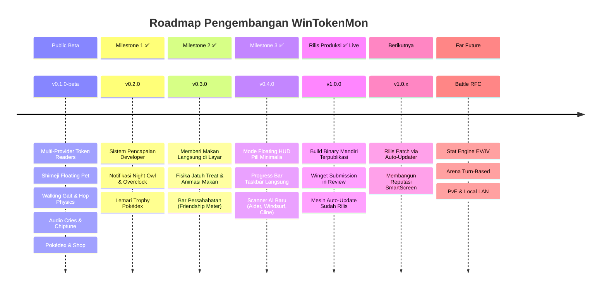

# 🗺️ Roadmap & Rencana Masa Depan: WinTokenMon

> **Language / Bahasa**: [**English**](../FUTURE-WORKS.md) | [**Bahasa Indonesia**](FUTURE-WORKS.id.md)

Dokumen ini menguraikan ikhtisar roadmap. Untuk dokumen RFC teknis lengkap dengan skema data, failure modes, dan mitigasi risiko, silakan buka [**Direktori Rencana Implementasi (`docs/plans/`)**](../plans/README.md).

---

## 🧭 Ikhtisar Milestone

> ✅ **Update status (22-08-2026)**: v1.0.0 Production GA sudah **live** — keempat milestone di bawah telah rilis. Bagian-bagian berikut dipertahankan sebagai referensi desain historis; satu-satunya item yang masih forward-looking adalah RFC Battle jangka jauh.



---

## 🏆 1. Sistem Pencapaian & Badge Developer (`v0.2.0`) — ✅ SELESAI
> 📑 **Dokumen Rencana Teknis (RFC)**: [**`docs/plans/v0.2.0-developer-achievements-and-badges.md`**](../plans/v0.2.0-developer-achievements-and-badges.md)

### Ikhtisar
Kerangka pencapaian yang memberikan hadiah bagi developer berdasarkan kebiasaan koding nyata, alur kerja multi-tool, dan pencapaian jangka panjang.

### Daftar Badge Pencapaian yang Direncanakan

| Badge | Judul | Kondisi / Pemicu | Hadiah |
| :--- | :--- | :--- | :--- |
| 🦉 | **Night Owl Coder** | Membakar $>100\text{k}$ token antara pukul 00:00 dan 05:00 waktu lokal | 🪙 5M Token Belanja |
| ⚡ | **Token Overclock** | Membakar $>1\text{M}$ token dalam rentang waktu 60 menit | 🍬 1x Rare Candy |
| 🐣 | **First Hatch** | Menetaskan telur Pokémon pertama Anda | 🪙 10M Token Belanja |
| ✨ | **Shiny Hunter** | Menetaskan varian Pokémon Shiny langka (peluang 1/129 atau 1/40) | ✨ 1x Shiny Charm |
| 🧙‍♂️ | **Multi-Tool Wizard** | Membakar token di 3+ tool AI berbeda dalam 1 hari yang sama | 🌿 2x Nature Mints |
| 💯 | **100M Burn Club** | Akumulasi total $100\text{M}$ token seumur hidup | 🏅 Badge Profil Emas |
| 🎓 | **Senior Professor** | Meluluskan 5 pendamping Pokémon ke status Senior | 🍬 5x Rare Candies |
| 🥚 | **Egg Hoarder** | Membeli semua Tier Telur di Shop (Standard, Uncommon, Rare, Legendary) | 🪙 50M Token Belanja |

---

## 🎈 2. Minigame Interaktif & Memberi Makan Langsung (`v0.3.0`) — ✅ SELESAI
> 📑 **Dokumen Rencana Teknis (RFC)**: [**`docs/plans/v0.3.0-interactive-feeding-and-friendship.md`**](../plans/v0.3.0-interactive-feeding-and-friendship.md)

### Mekanisme yang Direncanakan:
1. **Lempar Treat Langsung ke Layar**:
   - Di tab Inventori atau klik kanan pet, pilih *"Drop Rare Candy"* atau *"Drop Berry"*.
   - Ikon makanan jatuh ke lantai desktop dengan fisika pantulan gravitasi.
   - Pokémon mendeteksi koordinat makanan, berputar ke arahnya, berjalan dengan animasi melangkah, lalu memakannya (`😋` / `✨`).
2. **Mengelus & Persahabatan (*Friendship Meter*)**:
   - Menggerakkan kursor mengelus Pokémon memunculkan partikel hati (`💖`) dan mengisi **Bar Persahabatan Harian**.
   - Persahabatan tinggi membuka reaksi animasi eksklusif (salto gembira, pose tidur siang, dan suara cry spesial).

---

## 📊 3. Mode Floating HUD Pill & Scanner AI Tambahan (`v0.4.0`) — ✅ SELESAI
> 📑 **Dokumen Rencana Teknis (RFC)**: [**`docs/plans/v0.4.0-extended-ai-scanners-and-compact-hud.md`**](../plans/v0.4.0-extended-ai-scanners-and-compact-hud.md)

### Tampilan Konsep:
```
┌──────────────────────────────────────────────────────────┐
│  🔥 142.5k / 2.5M (5.7%)  │  🪙 12.4M  │  🍬 x3  │  [⚙️]  │
└──────────────────────────────────────────────────────────┘
```

### Provider AI yang Direncanakan:
| Provider | Path Target (Windows) | Format Data |
| :--- | :--- | :--- |
| **Aider** | `~/.aider.chat.history.md` / `.aider.tags.cache.v3` | Markdown metadata / JSON tokens |
| **Windsurf / Cascade** | `%APPDATA%\Windsurf\User\workspaceStorage\*\state.vscdb` | SQLite `mode=ro` |
| **Roo Code / Roo Cline** | `%APPDATA%\Code\User\globalStorage\rooveterinaryinc.roo-cline\` | JSON session history |
| **Cline (VS Code)** | `%APPDATA%\Code\User\globalStorage\saoudrizwan.claude-dev\` | JSON session logs |

---

## 📦 4. Rilis Produksi & Distribusi Resmi (`v1.0.0`) — ✅ LIVE
> 📑 **Dokumen Rencana Teknis (RFC)**: [**`docs/plans/v1.0.0-production-release-and-winget.md`**](../plans/v1.0.0-production-release-and-winget.md)

1. **Validasi Binary Rilis Mandiri**: Pengujian otomatis file portable `.exe` dan installer Inno Setup.
2. **Windows Package Manager (Winget)**: Registrasi resmi ke `microsoft/winget-pkgs` (`winget install WinTokenMon`).
3. **Pemberitahuan Pembaruan Otomatis**: Notifikasi saat ada rilis versi baru di GitHub Releases.

---

## 🌌 6. Cakupan Riset Jangka Panjang (Far-Future Scope)
> 📜 **Dokumen Spesifikasi Teknis Lengkap (RFC)**: [**`docs/plans/far-future-battle-ev-iv-and-movesets-rfc.md`**](../plans/far-future-battle-ev-iv-and-movesets-rfc.md)

> [!NOTE]
> Konsep berikut adalah inisiatif riset eksploratif jangka panjang. Fitur ini memerlukan diskusi komunitas, simulasi keseimbangan pertempuran, serta RFC arsitektur mendalam sebelum diimplementasikan. Untuk formula matematis resmi Smogon/Bulbapedia dan data stat lengkap, silakan baca dokumen RFC yang ditautkan di atas.

### ⚔️ A. Arena Pertarungan Trainer (PvP / PvE Jaringan Lokal)
- **Konsep**: Mengadu Pokémon terlatih Anda dalam pertarungan retro turn-based melawan sesama developer di jaringan lokal yang sama (LAN) atau melawan gym leader AI.
- **Formula Tempur**: Daya serang (*damage*) dan pertahanan dipengaruhi secara dinamis oleh streak koding harian, level Pokémon, dan modifier sifat (*nature*).
- **UI Pertarungan Retro**: Jendela pertempuran 8-bit tersendiri lengkap dengan bar HP, animasi serangan, dan pemutaran suara cry Pokémon.

### 📊 B. Sistem Pelatihan EV & IV Lengkap
- **Effort Values (EVs)**: Developer dapat mengalokasikan poin token belanja ke pelatihan stat spesifik (HP, Attack, Defense, Special Attack, Special Defense, Speed) di gym latihan.
- **Individual Values (IVs)**: Pokémon menetas dengan potensi bakat alami IV acak ($0 \to 31$) yang dapat diperiksa melalui fitur "Judge" di Pokédex.

### 🔥 C. Moveset & Jurus Bertarung Pokémon
- **Pembukaan Jurus**: Seiring Pokémon mengonsumsi token dan berevolusi, Pokémon mempelajari 4 jurus canonical (misal *Flamethrower*, *Thunderbolt*, *Hydro Pump*, *Dragon Claw*).
- **Sinergi Koding**: Event koding tertentu (misal menyelesaikan git conflict, menembus milestone 1M token) dapat memperkuat jurus tertentu untuk sementara waktu!

<p align="right"><sub style="color: gray;"><em>(manifesting that Nintendo's lawyers don't nuke this repo before I can finish implementing these...)</em></sub></p>

---

## 🤝 Berkontribusi pada Roadmap

Tertarik mengimplementasikan salah satu fitur di atas?
- Baca [Panduan Operasional & HOWTO](HOWTO.id.md) kami.
- Pilih salah satu fitur dari milestone di atas dan buka GitHub Issue atau Pull Request!
