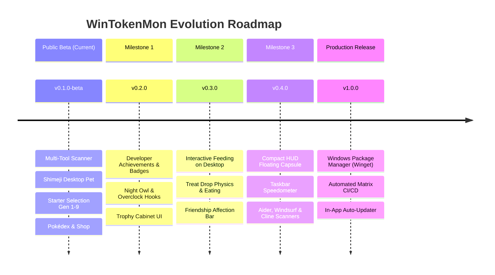

# 🗺️ Implementation Plans & Architectural RFCs Hub

Selamat datang di direktori **Implementation Plans (`docs/plans/`)** untuk **WinTokenMon**. Direktori ini berisi cetak biru arsitektur teknis (*Technical RFC Blueprints*) yang mendalam dan siap eksekusi untuk setiap rilis dan milestone mendatang.

---

## 🧭 Roadmap & Milestone Plans

---

## 📚 Daftar Dokumen Rencana Implementasi

| Milestone | Dokumen Rencana | Deskripsi & Fitur Utama | Status |
| :--- | :--- | :--- | :--- |
| **v0.2.0** | [**`v0.2.0-developer-achievements-and-badges.md`**](v0.2.0-developer-achievements-and-badges.md) | 🏆 **Sistem Gamifikasi & Badges**: Hook event listener token, 8+ lencana prestasi developer, hadiah EXP/Item, notifikasi toast Windows, dan tab Trophy Cabinet di Dashboard. | 📝 *Approved Design* |
| **v0.3.0** | [**`v0.3.0-interactive-feeding-and-friendship.md`**](v0.3.0-interactive-feeding-and-friendship.md) | 🎈 **Interaksi Fisika & Kasih Sayang**: Menjatuhkan treat (Berry / Rare Candy) ke desktop dengan gravitasi, pathfinding pet menghampiri makanan, animasi mengunyah, dan meteran Friendship harian. | 📝 *Approved Design* |
| **v0.4.0** | [**`v0.4.0-extended-ai-scanners-and-compact-hud.md`**](v0.4.0-extended-ai-scanners-and-compact-hud.md) | 📊 **Scanner Tambahan & HUD Kapsul**: Dukungan parsing log lokal Aider, Windsurf (Cascade), Roo Code/Cline, serta mode Floating HUD Capsule minimalis ($220 \times 32\text{px}$) dengan speedometer token. | 📝 *Approved Design* |
| **v1.0.0** | [**`v1.0.0-production-release-and-winget.md`**](v1.0.0-production-release-and-winget.md) | 📦 **Distribusi Resmi & Pembaruan Otomatis**: Integrasi katalog `microsoft/winget-pkgs`, CI/CD build matrix PyInstaller + Inno Setup, validasi checksum SHA256, dan engine auto-update background. | 📝 *Approved Design* |
| **Far-Future** | [**`far-future-battle-ev-iv-and-movesets-rfc.md`**](far-future-battle-ev-iv-and-movesets-rfc.md) | ⚔️ **Retro Battle Arena & Stat Engine RFC**: Formula perhitungan stat lengkap (EV, IV, Nature), formula kerusakan turnamen, sistem giliran bertarung, sinergi koding nyata (*Git streaks, Overclock weather*), dan mode PvE AI / Local LAN WiFi. | 🔬 *Research RFC* |

---

## 🏛️ Prinsip Rekayasa (Engineering Principles)

Setiap rancangan teknis di direktori ini mematuhi standar ketat WinTokenMon:

1. **100% Offline & Private First**:
   - Seluruh pemrosesan, pembacaan log token, data save game, dan evaluasi lencana prestasi dilakukan sepenuhnya secara lokal di PC pengguna.
   - Tidak ada source code, prompt, atau data telemetri yang dikirimkan ke cloud.
2. **Zero Performance Impact (<50MB RAM, <1% CPU)**:
   - Polling latar belakang dirancang non-blocking dengan thread terpisah.
   - Operasi I/O disk menggunakan mode read-only dan locking minimal.
   - Animasi UI menggunakan redaman matematika (*sine wave*, *spring physics*) yang efisien tanpa library berat.
3. **Robust Backward Compatibility**:
   - Skema `state.json` wajib mendukung migrasi tanpa henti (*seamless migration*) dari versi sebelumnya tanpa menghapus save game atau progres level pengguna.
4. **Vibe-Coding Guardrails**:
   - Setiap fitur baru wajib disertai unit test otomatis di `tests/`, lolos pengecekan `ruff check .` dan `ruff format .`, serta didokumentasikan dalam Bahasa Inggris dan Bahasa Indonesia.
