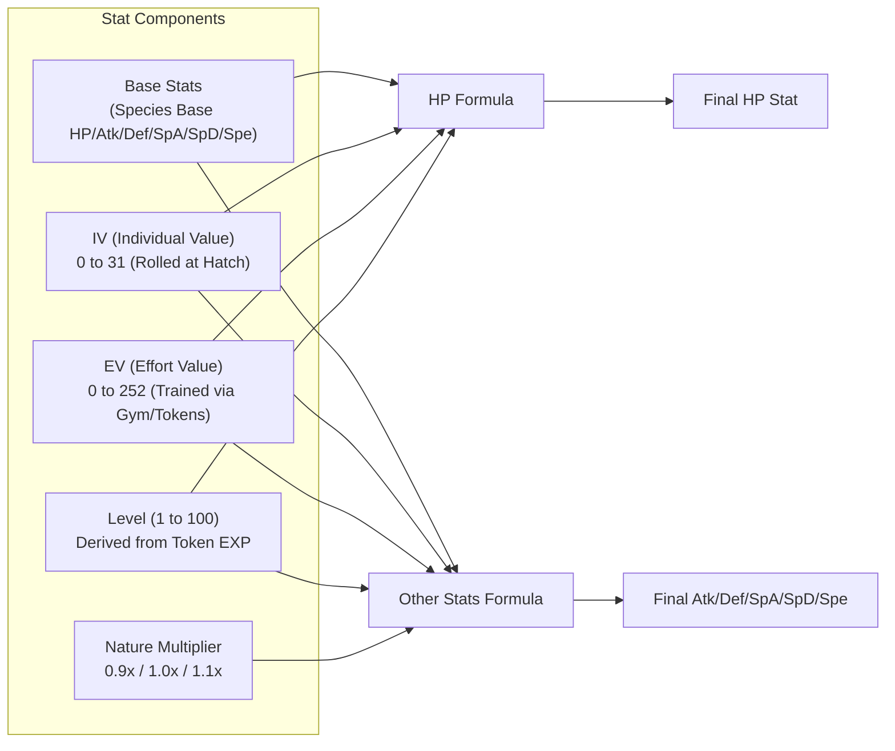
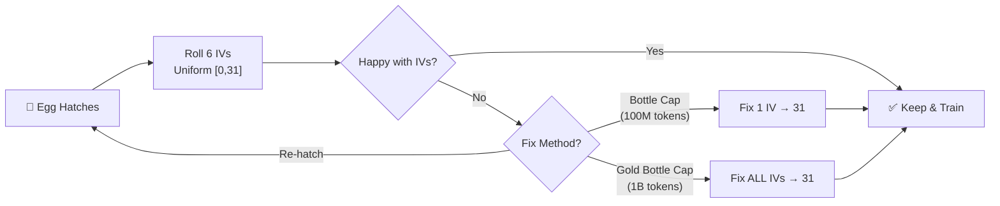
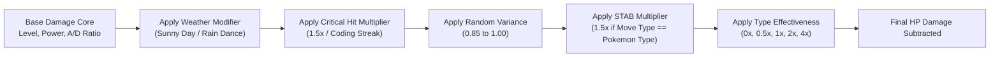
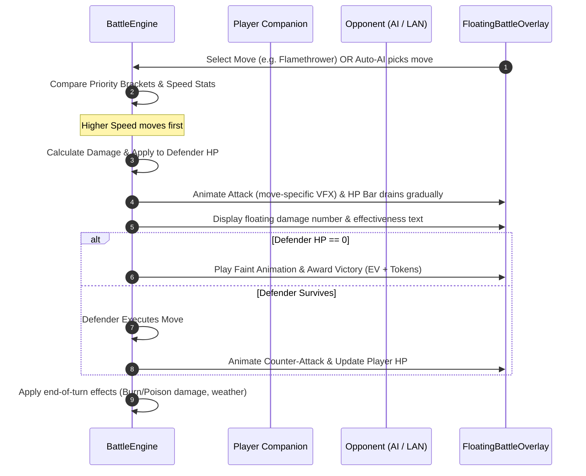
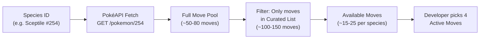
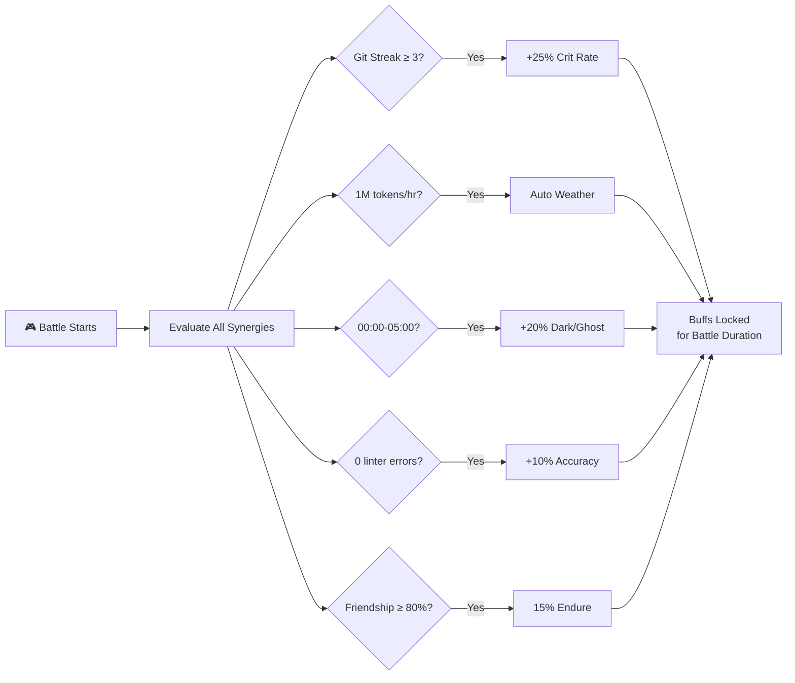
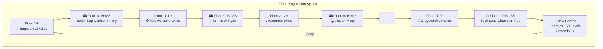
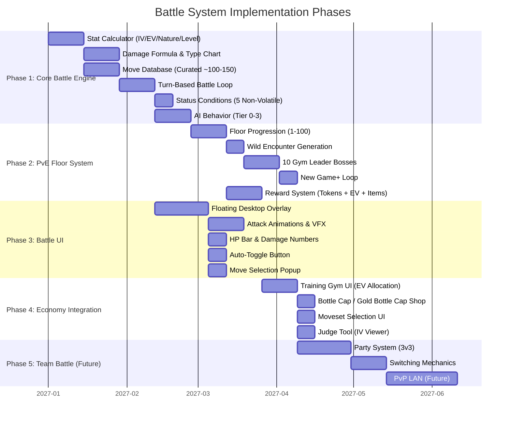

# 🌌 Technical RFC: Far-Future Battle Arena, EV/IV Stats & Combat Mechanics

> **Document Type**: 📜 *Architectural & Research RFC (Request for Comments)*  
> **Target Scope**: Far-Future Milestone (`v1.x` / Exploratory Community RFC)  
> **Status**: 🔬 *Baseline Research & Mathematical Specification*  
> **Language**: [**English / Bahasa Indonesia**](far-future-battle-ev-iv-and-movesets-rfc.md)  
> **Last Updated**: 2026-08-18 — *Enriched with implementation details, balancing, and architectural decisions*

---

## 1. 🎯 Executive Summary & Design Philosophy

Dalam rilis awal **WinTokenMon**, developer memelihara Pokémon pendamping dengan membakar jutaan token AI coding. Untuk memberikan kepuasan puncak dari proses grinding token tersebut, dokumen RFC ini merancang arsitektur sistem **Retro 8-Bit Battle Arena**:
1. **Stat Engine Autentik**: Mengimplementasikan formula perhitungan stat resmi Pokémon (Generasi 3–5) dengan sistem **Individual Values (IVs)**, **Effort Values (EVs)**, dan **Nature Modifiers**.
2. **Formula Kerusakan Standar Kompetitif**: Mengadaptasi *Damage Calculation Formula* standar turnamen (Smogon / Bulbapedia) dengan Physical/Special split, STAB (Same-Type Attack Bonus), dan kalkulasi efektivitas tipe.
3. **Developer Coding Synergies**: Menghubungkan aktivitas koding nyata (misalnya *Git Push Streaks*, *Token Overclock Bursts*, atau *Night Owl Coding*) dengan efek pertempuran in-game (bonus Critical Hit, Weather Buffs, dan elemental power-ups).
4. **100% Offline & Non-Intrusive**: Pertarungan dijalankan secara lokal (PvE melawan AI Gym Leaders) atau via jaringan lokal ringan (Local WiFi LAN P2P) tanpa memerlukan server cloud terpusat.
5. **Floor-Based PvE Progression**: Sistem floor bertingkat 1–100+ ala *Taskbar Heroes* dengan auto-battle mode, manual boss fights, dan New Game+ loop untuk replayability jangka panjang.
6. **Floating Desktop Battle Overlay**: Battle terjadi langsung di atas desktop sebagai floating overlay transparan — bukan di window terpisah — menyatu dengan pengalaman desktop pet yang sudah ada.

---

## 2. 📊 Sistem EV, IV, Nature & Rumus Stat Resmi



### A. Individual Values (IVs)
- Setiap Pokémon memiliki 6 nilai IV acak ($0 \to 31$) yang di-*roll* saat telur menetas:
  - $\text{HP}, \text{Attack}, \text{Defense}, \text{Sp. Attack}, \text{Sp. Defense}, \text{Speed}$.
- Nilai IV menentukan potensi bawaan (bakat alami) Pokémon. Pemain dapat memeriksa kualitas IV melalui fitur *"Judge Tool"* di Pokédex.

#### IV Generation Rules
- **Distribusi**: Pure random uniform $[0, 31]$ untuk **semua egg tiers** — Standard, Uncommon, Rare, dan Legendary mendapat distribusi IV yang sama rata.
- **Tidak ada privilege tier**: Egg mahal TIDAK menjamin IV lebih tinggi. Ini membuat setiap hatch tetap menegangkan.
- **Penentuan saat hatch**: IV di-*roll* sekali saat telur menetas dan **permanen** — kecuali menggunakan item Hyper Training.

#### Hyper Training (IV Fixing)
Untuk memberikan endgame sink bagi developer yang ingin menyempurnakan IV Pokémon mereka:

| Item | Efek | Harga (Spendable Tokens) |
| :--- | :--- | :--- |
| **🍶 Bottle Cap** | Menaikkan **1 IV stat** ke nilai sempurna (31) | **100,000,000** (100M) |
| **🏆 Gold Bottle Cap** | Menaikkan **SEMUA 6 IV stats** ke nilai sempurna (31) | **1,000,000,000** (1B) |

> [!NOTE]
> Hyper Training hanya mengubah nilai IV yang digunakan dalam kalkulasi stat — IV asli tetap tercatat di data Pokémon untuk transparansi. Ini memungkinkan "perfect IV" tanpa menghilangkan sejarah roll asli.



---

### B. Effort Values (EVs)
- **Batas EV**: Maksimal **252 EV per stat**, dengan total akumulasi **510 EV** untuk seluruh stat.

#### Mekanisme Earning EV

EV diperoleh melalui **dua jalur**:

##### 1. Training Gym (Manual RPG-Style Allocation)
Developer mengalokasikan *Spendable Tokens* di menu **"Training Gym"** untuk menaikkan EV stat tertentu secara manual:

| Parameter | Nilai |
| :--- | :--- |
| **Harga per 1 EV** | **10,000 spendable tokens** |
| **Biaya max out 1 stat (252 EV)** | **2,520,000** (2.52M tokens) |
| **Biaya max out semua (510 EV)** | **5,100,000** (5.1M tokens) |
| **Cap per stat** | 252 EV |
| **Cap total** | 510 EV |

> [!TIP]
> Harga EV sengaja dibuat **accessible** (2.52M buat max 1 stat, vs 25M buat Rare Candy). Ini karena EV training adalah *fondasi* strategi battle — developer harus bisa bereksperimen dengan berbagai EV spread tanpa grind berlebihan. Fokus game ada di **decision making** (spread mana yang optimal), bukan **resource gatekeeping**.

```python
# EV Training Economy Constants
EV_COST_PER_POINT = 10_000  # 10k spendable tokens per 1 EV
EV_MAX_PER_STAT = 252  # Standard Pokémon cap
EV_MAX_TOTAL = 510  # Standard Pokémon total cap

# Example EV Spreads
COMPETITIVE_SPREADS = {
    "Physical Sweeper": {"hp": 0, "atk": 252, "def": 0, "spa": 0, "spd": 4, "spe": 252},
    "Special Wall": {"hp": 252, "atk": 0, "def": 0, "spa": 0, "spd": 252, "spe": 4},
    "Bulky Attacker": {"hp": 252, "atk": 252, "def": 4, "spa": 0, "spd": 0, "spe": 0},
    "Fast Special": {"hp": 0, "atk": 0, "def": 0, "spa": 252, "spd": 4, "spe": 252},
}
```

##### 2. Battle Rewards (Passive via PvE Floor Clears)
Setiap floor battle yang dimenangkan memberikan **+1 hingga +4 EV** pada stat yang relevan dengan tipe lawan:

| Tipe Pokémon Lawan | EV Stat yang Diberikan |
| :--- | :--- |
| 🐛 Bug / 🌿 Grass | Speed EV |
| 🪨 Rock / 🏜️ Ground | Defense EV |
| 💧 Water / ❄️ Ice | Sp. Defense EV |
| 🔥 Fire / ⚡ Electric | Sp. Attack EV |
| 👊 Fighting / ☠️ Poison | Attack EV |
| ⚪ Normal / 🦅 Flying | HP EV |
| Lainnya | Random dari 6 stat |

> [!NOTE]
> EV dari battle tetap mematuhi cap 252/510. Jika stat sudah penuh, EV overflow tidak diberikan.

#### Setiap $4 \text{ EV}$ bernilai $+1$ poin stat pada Level 100.

---

### C. Nature Stat Multiplier
Terdapat 25 sifat (*Nature*) Pokémon. Sifat netral bernilai $1.0\times$, sedangkan sifat spesifik memberikan bonus $+10\%$ ($1.1\times$) pada satu stat dan penalti $-10\%$ ($0.9\times$) pada stat lain:

| Nature | Boosted Stat (+10%) | Hindered Stat (-10%) | Coding Vibe Theme |
| :--- | :--- | :--- | :--- |
| **Adamant** | Attack ($\text{Atk}$) | Sp. Attack ($\text{SpA}$) | *Raw Performance / High Output* |
| **Modest** | Sp. Attack ($\text{SpA}$) | Attack ($\text{Atk}$) | *Clean Logic / Algorithmic* |
| **Jolly** | Speed ($\text{Spe}$) | Sp. Attack ($\text{SpA}$) | *Fast Prototyper / Agile* |
| **Timid** | Speed ($\text{Spe}$) | Attack ($\text{Atk}$) | *Quick Refactorer* |
| **Bold** | Defense ($\text{Def}$) | Attack ($\text{Atk}$) | *Defensive / Test-Driven* |
| **Hardy / Serious** | Netral ($1.0\times$) | Netral ($1.0\times$) | *Balanced Developer* |

---

### D. Formula Matematis Kalkulasi Stat (Gen 3+)

Sesuai referensi resmi [Bulbapedia Stat Calculation](https://bulbapedia.bulbagarden.net/wiki/Stat):

#### 1. Formula Perhitungan HP:
$$\text{HP} = \left\lfloor \frac{(2 \times \text{Base}_{\text{HP}} + \text{IV}_{\text{HP}} + \lfloor \frac{\text{EV}_{\text{HP}}}{4} \rfloor) \times \text{Level}}{100} \right\rfloor + \text{Level} + 10$$
*(Pengecualian: Shedinja selalu memiliki HP = 1)*

#### 2. Formula Perhitungan Lima Stat Lainnya ($\text{Atk}, \text{Def}, \text{SpA}, \text{SpD}, \text{Spe}$):
$$\text{Stat} = \left\lfloor \left( \left\lfloor \frac{(2 \times \text{Base} + \text{IV} + \lfloor \frac{\text{EV}}{4} \rfloor) \times \text{Level}}{100} \right\rfloor + 5 \right) \times \text{Nature} \right\rfloor$$

Di mana:
- $\lfloor x \rfloor$ adalah fungsi *floor* (pembulatan ke bawah integer).
- $\text{Nature} \in \{0.9, 1.0, 1.1\}$.

#### 3. Level Derivation dari Token Progress

Level battle di-*derive* secara linear dari progress token terhadap graduation threshold:

$$\text{Level} = \max\left(1, \left\lfloor \frac{\text{Lifetime Tokens Burned}}{\text{Graduation Total}(\text{Rarity})} \times 100 \right\rfloor \right)$$

| Rarity | Graduation Total | Tokens per Level | Level 50 @ |
| :--- | :--- | :--- | :--- |
| Common | 250M | 2.5M / level | 125M tokens |
| Uncommon | 750M | 7.5M / level | 375M tokens |
| Rare | 2.0B | 20M / level | 1.0B tokens |
| Legendary | 5.0B | 50M / level | 2.5B tokens |

- Pokémon yang sudah **graduated** = otomatis **Level 100**.
- Pokémon yang belum graduated = level proporsional terhadap progress mereka.

#### 4. Base Stats Source

Base stats per spesies di-fetch dari **PokéAPI** (`https://pokeapi.co/api/v2/pokemon/{id}`) saat pertama kali Pokémon ditemui (hatch atau battle encounter), lalu di-cache locally di `%APPDATA%/WinTokenMon/base_stats_cache.json`.

```python
# Example: Fetching base stats from PokéAPI
def fetch_base_stats(species_id: int) -> dict[str, int]:
    """Fetch and cache base stats from PokéAPI."""
    url = f"https://pokeapi.co/api/v2/pokemon/{species_id}"
    data = fetch_json(url)
    stats = {}
    for stat_entry in data["stats"]:
        stat_name = stat_entry["stat"]["name"]  # "hp", "attack", "defense", etc.
        stats[stat_name] = stat_entry["base_stat"]
    return stats
    # Returns e.g.: {"hp": 78, "attack": 84, "defense": 78,
    #                "special-attack": 109, "special-defense": 85, "speed": 100}
```

---

## 3. ⚔️ Formula Kerusakan Pertarungan (Damage Calculation Formula)

Sesuai penelitian kompetitif [Smogon Damage Formula Research](https://www.smogon.com/dp/articles/damage_formula) dan [Bulbapedia Damage](https://bulbapedia.bulbagarden.net/wiki/Damage):



### A. Formula Matematis Inti

$$\text{Damage} = \left\lfloor \left( \left\lfloor \frac{\left\lfloor \frac{2 \times \text{Level}}{5} + 2 \right\rfloor \times \text{Power} \times \frac{A}{D}}{50} \right\rfloor + 2 \right) \times \text{Modifier} \right\rfloor$$

Di mana:
- **$\text{Level}$**: Level penyerang saat ini ($1 \to 100$).
- **$\text{Power}$**: Kekuatan dasar jurus (*Base Power*, misal *Flamethrower* = 90, *Thunderbolt* = 90, *Tackle* = 40).
- **$A$ (Attack Stat)**:
  - Menggunakan $\text{Attacker.Attack}$ jika kategori jurus adalah **Physical** (Fisik).
  - Menggunakan $\text{Attacker.SpAttack}$ jika kategori jurus adalah **Special** (Spesial).
- **$D$ (Defense Stat)**:
  - Menggunakan $\text{Defender.Defense}$ untuk jurus **Physical**.
  - Menggunakan $\text{Defender.SpDefense}$ untuk jurus **Special**.

---

### B. Komposisi Nilai Modifier

$$\text{Modifier} = \text{Weather} \times \text{Crit} \times \text{Random} \times \text{STAB} \times \text{Type} \times \text{Burn}$$

| Faktor Modifier | Nilai | Keterangan |
| :--- | :--- | :--- |
| **Weather** | $1.5\times$ / $0.5\times$ / $1.0\times$ | *Sunny Day* memperkuat Fire ($1.5\times$) dan melemahkan Water ($0.5\times$). |
| **Critical Hit** | $1.5\times$ (atau $2.0\times$ dengan perk) | Mengabaikan buff pertahanan lawan. |
| **Random Variance** | $[0.85, 1.00]$ | Variasi acak integer seragam: $\frac{R}{100}$ di mana $R \in [85, 100]$. |
| **STAB (Same-Type Attack Bonus)**| $1.5\times$ ($2.0\times$ dengan Adaptability) | Diberikan jika tipe jurus sama dengan salah satu tipe Pokémon penyerang. |
| **Type Effectiveness** | $0.0\times$, $0.25\times$, $0.5\times$, $1.0\times$, $2.0\times$, $4.0\times$ | Berdasarkan matriks efektivitas 18 tipe Pokémon resmi. |
| **Burn Penalty** | $0.5\times$ | Mengurangi separuh kerusakan jurus fisik jika penyerang terkena status Burn. |

---

### C. Matriks Efektivitas Tipe (18 Elemental Types)

Mengadopsi aturan standar [Bulbapedia Type Matrix](https://bulbapedia.bulbagarden.net/wiki/Type) dengan **full 18 types**:

| Type | Super Effective ($2\times$) vs | Not Very Effective ($0.5\times$) vs | Immune ($0\times$) vs |
| :--- | :--- | :--- | :--- |
| 🔥 **Fire** | Grass, Ice, Bug, Steel | Fire, Water, Rock, Dragon | — |
| 💧 **Water** | Fire, Ground, Rock | Water, Grass, Dragon | — |
| 🌿 **Grass** | Water, Ground, Rock | Fire, Grass, Poison, Flying, Bug, Dragon, Steel | — |
| ⚡ **Electric** | Water, Flying | Electric, Grass, Dragon | Ground |
| ❄️ **Ice** | Grass, Ground, Flying, Dragon | Fire, Water, Ice, Steel | — |
| 👊 **Fighting** | Normal, Ice, Rock, Dark, Steel | Poison, Flying, Psychic, Bug, Fairy | Ghost |
| ☠️ **Poison** | Grass, Fairy | Poison, Ground, Rock, Ghost | Steel |
| 🏜️ **Ground** | Fire, Electric, Poison, Rock, Steel | Grass, Bug | Flying |
| 🦅 **Flying** | Grass, Fighting, Bug | Electric, Rock, Steel | — |
| 🔮 **Psychic** | Fighting, Poison | Psychic, Steel | Dark |
| 🐛 **Bug** | Grass, Psychic, Dark | Fire, Fighting, Poison, Flying, Ghost, Steel, Fairy | — |
| 🪨 **Rock** | Fire, Ice, Flying, Bug | Fighting, Ground, Steel | — |
| 👻 **Ghost** | Psychic, Ghost | Dark | Normal |
| 🐉 **Dragon** | Dragon | Steel | Fairy |
| 🌑 **Dark** | Psychic, Ghost | Fighting, Dark, Fairy | — |
| ⚙️ **Steel** | Ice, Rock, Fairy | Fire, Water, Electric, Steel | — |
| 🧚 **Fairy** | Fighting, Dragon, Dark | Fire, Poison, Steel | — |
| ⚪ **Normal** | — | Rock, Steel | Ghost |

> [!IMPORTANT]
> Type chart di-implementasikan sebagai `dict[tuple[str, str], float]` lookup table. Data source: Bulbapedia type matrix, hardcoded di codebase untuk offline reliability.

---

## 4. 🕹️ Sistem Giliran (Turn-Based Battle Loop) & Status Conditions



### A. Penentuan Giliran (*Turn Order & Priority*)
Sesuai standar [Bulbapedia Priority](https://bulbapedia.bulbagarden.net/wiki/Priority):
1. **Priority Bracket**: Jurus dengan prioritas lebih tinggi selalu bergerak duluan:
   - Priority $+1$: *Quick Attack*, *Aqua Jet*, *Mach Punch*.
   - Priority $0$: Sebagian besar jurus standar (*Flamethrower*, *Surf*, *Thunderbolt*).
   - Priority $-6$: *Roar*, *Whirlwind*.
2. **Speed Stat Comparison**: Jika prioritas sama, Pokémon dengan stat $\text{Speed}$ lebih tinggi bergerak lebih dulu. Jika seri (*Speed tie*), pemenang giliran diundi secara acak 50:50.

### B. Kondisi Status (*Status Ailments*)
Sesuai standar [Bulbapedia Status Conditions](https://bulbapedia.bulbagarden.net/wiki/Status_condition), **semua 5 non-volatile status** diimplementasikan:

| Status | Efek Tiap Giliran | Efek Tambahan |
| :--- | :--- | :--- |
| 🔥 **Burn ($\text{BRN}$)** | $-\frac{1}{16} \text{ Max HP}$ di akhir giliran | Output kerusakan jurus Physical $-50\%$ |
| ⚡ **Paralysis ($\text{PAR}$)** | Peluang $25\%$ gagal menyerang (*fully paralyzed*) | Stat Speed $-50\%$ |
| 💤 **Sleep ($\text{SLP}$)** | Tidak dapat menyerang | Durasi $1 \to 3$ giliran acak |
| ☠️ **Poison ($\text{PSN}$)** | $-\frac{1}{8} \text{ Max HP}$ di akhir giliran | — |
| ❄️ **Freeze ($\text{FRZ}$)** | Tidak bisa bergerak | Peluang $20\%$ mencair setiap giliran |

```python
@dataclass
class StatusCondition:
    """Non-volatile status ailment applied to a Pokémon."""

    status_type: str  # "burn" | "paralysis" | "sleep" | "poison" | "freeze"
    remaining_turns: int = -1  # -1 = indefinite (burn/para/poison), >0 = sleep/freeze countdown

    def apply_end_of_turn(self, pokemon: "BattlePokemon") -> int:
        """Apply end-of-turn damage. Returns damage dealt."""
        if self.status_type == "burn":
            return pokemon.max_hp // 16
        elif self.status_type == "poison":
            return pokemon.max_hp // 8
        return 0

    def can_move(self) -> bool:
        """Check if Pokémon can act this turn."""
        if self.status_type == "sleep":
            if self.remaining_turns > 0:
                self.remaining_turns -= 1
                return False
            return True  # Woke up
        if self.status_type == "freeze":
            if random.random() < 0.20:  # 20% thaw chance
                return True  # Thawed
            return False
        if self.status_type == "paralysis":
            return random.random() >= 0.25  # 75% chance to move
        return True
```

### C. Auto-Battle Toggle

Pertarungan memiliki toggle **[⚡ Auto]** yang dapat diaktifkan/dinonaktifkan **kapan saja** selama battle — langsung di battle overlay UI, bukan di settings:

| Mode | Perilaku | Kapan Dipakai |
| :--- | :--- | :--- |
| **Auto ON** | AI otomatis memilih move optimal untuk player | Floor biasa (grinding), nonton battle |
| **Auto OFF** | Player manual memilih move tiap giliran | Boss fights, PvP, challenging battles |

- Toggle default: **Auto ON** untuk regular floors, **Auto OFF** saat memasuki boss floor.
- Player dapat override kapan saja dengan menekan tombol [⚡ Auto] di overlay.

---

## 5. 💡 Movesets & Integrasi Sinergi Koding (Developer Synergies)

### A. 4 Slot Jurus & Struktur Data
Setiap Pokémon dapat menguasai hingga 4 jurus aktif:

```python
@dataclass
class Move:
    id: str  # e.g. "flamethrower"
    name: str  # "Flamethrower"
    element_type: str  # "Fire"
    category: str  # "Physical" | "Special" | "Status"
    base_power: int  # 90 (0 for Status moves)
    accuracy: int  # 100 (%)
    max_pp: int  # 15 (Power Points)
    current_pp: int
    priority: int = 0
    effect_chance: float = 0.10  # 10% burn chance
    status_effect: str = ""  # "burn" | "paralysis" | etc.
    stat_changes: dict = None  # {"atk": +2} for Swords Dance
```

### B. Moveset Acquisition: Free Choice dari Canonical Pool

Pokémon **bebas memilih** 4 moves dari **canonical species move pool** — tanpa batasan level. Move pool ditentukan oleh:

1. **Semua moves dari tipe Pokémon sendiri** (Treecko/Grass = semua Grass moves dalam curated list)
2. **Normal type moves** (universal — setiap Pokémon bisa learn Normal moves)
3. **Coverage moves** yang species tersebut **canonically bisa pelajari** menurut PokéAPI data (`pokemon/{id}/moves`)



**Contoh: Sceptile (#254)**
- Dari PokéAPI, Sceptile bisa learn: Pound, Absorb, Mega Drain, Bullet Seed, Leaf Blade, Leaf Storm, Dragon Pulse, Earthquake, Rock Slide, Aerial Ace, X-Scissor, Swords Dance, etc.
- Filter hanya yang ada di curated list → ~20 moves tersedia.
- Developer pilih 4: misal {Leaf Blade, Dragon Pulse, Earthquake, Swords Dance}.

### C. Curated Move Database (~100-150 Iconic Moves)

Move database di-hardcode di codebase sebagai curated subset dari PokéAPI data. Hanya moves yang **iconic, well-known, dan balance-tested** yang disertakan:

#### Physical Moves (Contoh Subset)

| Move | Type | Power | Acc | PP | Effect |
| :--- | :--- | :--- | :--- | :--- | :--- |
| Earthquake | Ground | 100 | 100 | 10 | — |
| Close Combat | Fighting | 120 | 100 | 5 | User Def/SpD -1 |
| Dragon Claw | Dragon | 80 | 100 | 15 | — |
| Waterfall | Water | 80 | 100 | 15 | 20% flinch |
| Flare Blitz | Fire | 120 | 100 | 15 | 1/3 recoil, 10% burn |
| Iron Head | Steel | 80 | 100 | 15 | 30% flinch |
| Leaf Blade | Grass | 90 | 100 | 15 | High crit ratio |
| X-Scissor | Bug | 80 | 100 | 15 | — |
| Crunch | Dark | 80 | 100 | 15 | 20% Def -1 |
| Ice Punch | Ice | 75 | 100 | 15 | 10% freeze |
| Thunder Punch | Electric | 75 | 100 | 15 | 10% paralysis |
| Brave Bird | Flying | 120 | 100 | 15 | 1/3 recoil |
| Poison Jab | Poison | 80 | 100 | 20 | 30% poison |
| Stone Edge | Rock | 100 | 80 | 5 | High crit ratio |
| Shadow Claw | Ghost | 70 | 100 | 15 | High crit ratio |
| Zen Headbutt | Psychic | 80 | 90 | 15 | 20% flinch |
| Play Rough | Fairy | 90 | 90 | 10 | 10% Atk -1 |
| Quick Attack | Normal | 40 | 100 | 30 | Priority +1 |
| Aqua Jet | Water | 40 | 100 | 20 | Priority +1 |
| Mach Punch | Fighting | 40 | 100 | 30 | Priority +1 |

#### Special Moves (Contoh Subset)

| Move | Type | Power | Acc | PP | Effect |
| :--- | :--- | :--- | :--- | :--- | :--- |
| Flamethrower | Fire | 90 | 100 | 15 | 10% burn |
| Thunderbolt | Electric | 90 | 100 | 15 | 10% paralysis |
| Ice Beam | Ice | 90 | 100 | 10 | 10% freeze |
| Psychic | Psychic | 90 | 100 | 10 | 10% SpD -1 |
| Shadow Ball | Ghost | 80 | 100 | 15 | 20% SpD -1 |
| Surf | Water | 90 | 100 | 15 | — |
| Energy Ball | Grass | 90 | 100 | 10 | 10% SpD -1 |
| Dragon Pulse | Dragon | 85 | 100 | 10 | — |
| Dark Pulse | Dark | 80 | 100 | 15 | 20% flinch |
| Flash Cannon | Steel | 80 | 100 | 10 | 10% SpD -1 |
| Hydro Pump | Water | 110 | 80 | 5 | — |
| Fire Blast | Fire | 110 | 85 | 5 | 10% burn |
| Thunder | Electric | 110 | 70 | 10 | 30% paralysis |
| Blizzard | Ice | 110 | 70 | 5 | 10% freeze |
| Focus Blast | Fighting | 120 | 70 | 5 | 10% SpD -1 |
| Sludge Bomb | Poison | 90 | 100 | 10 | 30% poison |
| Air Slash | Flying | 75 | 95 | 15 | 30% flinch |
| Bug Buzz | Bug | 90 | 100 | 10 | 10% SpD -1 |
| Moonblast | Fairy | 95 | 100 | 15 | 30% SpA -1 |
| Aura Sphere | Fighting | 80 | ∞ | 20 | Never misses |

#### Status Moves (Contoh Subset)

| Move | Type | Effect | PP |
| :--- | :--- | :--- | :--- |
| Swords Dance | Normal | User Atk +2 | 20 |
| Calm Mind | Psychic | User SpA +1, SpD +1 | 20 |
| Dragon Dance | Dragon | User Atk +1, Spe +1 | 20 |
| Toxic | Poison | Badly poisons target | 10 |
| Will-O-Wisp | Fire | Burns target | 15 |
| Thunder Wave | Electric | Paralyzes target | 20 |
| Protect | Normal | Blocks all damage this turn | 10 |
| Stealth Rock | Rock | Sets entry hazard (dmg on switch-in) | 20 |
| Roost | Flying | Heals 50% HP | 10 |
| Recover | Normal | Heals 50% HP | 10 |

> [!NOTE]
> Full curated list (~100-150 moves) akan difinalisasikan saat implementasi. Data base_power, accuracy, PP, dan effect di-pull dari PokéAPI pada build-time lalu di-hardcode di codebase untuk operasi offline.

---

### D. Sinergi Koding Nyata (*Real-World Developer Synergies*)

WinTokenMon menghadirkan mekanik unik di mana aktivitas koding developer di dunia nyata memberikan buff taktis pada pertarungan:

```
+-----------------------------------------------------------------------------------+
| 🌟 DEVELOPER CODING SYNERGIES                                                     |
+-----------------------------------------------------------------------------------+
| 1. 🚀 Git Push Streak (>= 3 Days)      -> +25% Critical Hit Chance               |
| 2. ⚡ Token Overclock (>1M Tokens)     -> Auto-weather on entry (Sun/Rain/Terrain)|
| 3. 🦉 Night Owl Session (00:00-05:00)  -> +20% Power on Dark & Ghost Moves        |
| 4. 🧹 0-Linter Error Streak (Ruff Clean) -> +10% Accuracy on All Moves            |
| 5. 🍬 High Friendship (>= 80%)         -> 15% Chance to endure lethal hit with 1HP|
+-----------------------------------------------------------------------------------+
```

#### Synergy Evaluation Timing: Session-Based

Synergy buffs di-evaluate **satu kali saat battle dimulai** dan berlaku sepanjang durasi battle tersebut:



```python
@dataclass
class BattleSynergies:
    """Evaluated once at battle start, locked for the entire battle session."""

    crit_boost: bool = False  # Git Push Streak >= 3 days
    auto_weather: str | None = None  # Token Overclock > 1M/hr -> "sun" or "rain"
    dark_ghost_boost: bool = False  # Night Owl Session (00:00-05:00)
    accuracy_boost: bool = False  # 0-Linter Error Streak
    endure_chance: bool = False  # High Friendship >= 80%

    @classmethod
    def evaluate(cls, store: "CompanionStore") -> "BattleSynergies":
        """Snapshot current coding activity into battle buffs."""
        synergies = cls()
        synergies.crit_boost = store.git_push_streak_days >= 3
        synergies.auto_weather = "sun" if store.token_burn_last_hour > 1_000_000 else None
        current_hour = datetime.now().hour
        synergies.dark_ghost_boost = 0 <= current_hour < 5
        synergies.accuracy_boost = store.linter_error_count == 0
        synergies.endure_chance = store.friendship_percent >= 80
        return synergies
```

---

## 6. 🌐 Mode Pertarungan (Game Modes)

### Mode 1: PvE Floor Progression (Single Player — Taskbar Heroes Style)



#### Floor Encounter Design

| Floor Range | Zone Theme | Dominant Wild Types | Boss (Gym Leader) |
| :--- | :--- | :--- | :--- |
| 1–9 | 🐛 *Bug Forest* | Bug, Normal, Grass | — |
| **10** | 🏟️ **Gym Battle** | — | **Junior Bug Catcher Timmy** (🐛 Bug) |
| 11–19 | 🪨 *Rocky Cavern* | Rock, Ground, Steel | — |
| **20** | 🏟️ **Gym Battle** | — | **Intern Rock Ryan** (🪨 Rock/Ground) |
| 21–29 | 💧 *Aqua Lab* | Water, Ice | — |
| **30** | 🏟️ **Gym Battle** | — | **QA Tester Misty** (💧 Water) |
| 31–39 | ⚡ *Server Farm* | Electric, Steel | — |
| **40** | 🏟️ **Gym Battle** | — | **DevOps Engineer Volt** (⚡ Electric/⚙️ Steel) |
| 41–49 | 🌿 *Garden Terrace* | Grass, Fairy, Bug | — |
| **50** | 🏟️ **Gym Battle** | — | **Scrum Master Erika** (🌿 Grass/🧚 Fairy) |
| 51–59 | ☠️ *Dark Subnet* | Poison, Ghost, Dark | — |
| **60** | 🏟️ **Gym Battle** | — | **Security Analyst Koga** (☠️ Poison/👻 Ghost) |
| 61–69 | 🔮 *Neural Lab* | Psychic, Fairy | — |
| **70** | 🏟️ **Gym Battle** | — | **Algorithm Master Sabrina** (🔮 Psychic) |
| 71–79 | 🏜️ *Bare Metal* | Ground, Rock, Fighting | — |
| **80** | 🏟️ **Gym Battle** | — | **DBA Giovanni** (🏜️ Ground/🪨 Rock) |
| 81–89 | 🐉 *Dragon's Lair* | Dragon, Fire, Flying | — |
| **90** | 🏟️ **Gym Battle** | — | **Principal Architect Lance** (🐉 Dragon) |
| 91–99 | 🔥💧🌿 *Mixed Gauntlet* | All types (random) | — |
| **100** | 👑 **CHAMPION** | — | **Tech Lead Champion Red** (🔥🐉💧 Multi) |

#### Wild Encounter Generation

- **Species selection**: Random dari pool Pokémon yang sesuai tipe zona (menggunakan PokéAPI type data, cached)
- **Level**: = floor number (Floor 1 = Lv.1, Floor 47 = Lv.47, Floor 99 = Lv.99)
- **Moves**: Random 4 moves dari species pool
- **IVs**: Random 0-31 (wild Pokémon juga punya IVs)
- **EVs**: 0 (wild Pokémon tidak punya EV training)

#### Gym Leader Boss Details

| # | Gym Leader | Pokémon Team | Level | Badge Reward | Item Reward |
| :--- | :--- | :--- | :--- | :--- | :--- |
| 1 | 🐛 **Junior Bug Catcher Timmy** | Caterpie, Weedle | Floor Lv | *Bug Tracker Badge* | 🪙 5M Tokens |
| 2 | 🪨 **Intern Rock Ryan** | Geodude, Onix | Floor Lv | *Stack Overflow Badge* | 🍬 1x Rare Candy |
| 3 | 💧 **QA Tester Misty** | Staryu, Starmie | Floor Lv | *Regression Badge* | 🌿 1x Nature Mint |
| 4 | ⚡ **DevOps Engineer Volt** | Magnemite, Electrode | Floor Lv | *CI/CD Badge* | 🍬 2x Rare Candy |
| 5 | 🌿 **Scrum Master Erika** | Tangela, Vileplume | Floor Lv | *Sprint Badge* | 🌿 2x Nature Mint |
| 6 | ☠️ **Security Analyst Koga** | Koffing, Gengar | Floor Lv | *CVE Badge* | 🍶 1x Bottle Cap |
| 7 | 🔮 **Algorithm Master Sabrina** | Alakazam, Espeon | Floor Lv | *Big-O Badge* | 🍶 1x Bottle Cap |
| 8 | 🏜️ **DBA Giovanni** | Rhyhorn, Nidoking | Floor Lv | *ACID Badge* | 🍬 3x Rare Candy |
| 9 | 🐉 **Principal Architect Lance** | Dragonair, Dragonite | Floor Lv | *System Design Badge* | 🍶 2x Bottle Cap |
| 10 | 👑 **Tech Lead Champion Red** | Charizard, Blastoise, Venusaur | Floor Lv | 🏆 *Staff Principal Trophy* | 🏆 1x Gold Bottle Cap |

> [!TIP]
> Gym Leader Pokémon level = floor number. Di New Game+ cycle, level = floor + (50 × NG+ count). Contoh: NG+1 Floor 10 boss = Lv.60, NG+2 Floor 10 boss = Lv.110.

#### AI Behavior — Tiered Sophistication

| AI Tier | Applied To | Move Selection Strategy |
| :--- | :--- | :--- |
| **Tier 0 — Random** | Regular floor wilds | Random move from available pool |
| **Tier 1 — Damage Max** | Gym Leaders 1–3 (Timmy, Ryan, Misty) | Pick highest base power move available |
| **Tier 2 — Type Aware** | Gym Leaders 4–7 (Volt, Erika, Koga, Sabrina) | Prefer super effective moves → then highest power |
| **Tier 3 — Strategic** | Gym Leaders 8–10 (Giovanni, Lance, Red) | Type advantage + setup moves (Swords Dance turn 1 if safe) + priority move usage |

```python
class AIBehavior:
    """AI opponent move selection with tiered intelligence."""

    def select_move(
        self, tier: int, attacker: "BattlePokemon", defender: "BattlePokemon", type_chart: dict
    ) -> Move:
        available = [m for m in attacker.moves if m.current_pp > 0]
        if not available:
            return STRUGGLE_MOVE  # Fallback

        if tier == 0:  # Random
            return random.choice(available)

        if tier == 1:  # Damage Max
            return max(available, key=lambda m: m.base_power)

        if tier >= 2:  # Type Aware

            def score(m: Move) -> float:
                eff = type_chart.get((m.element_type, defender.type1), 1.0)
                if defender.type2:
                    eff *= type_chart.get((m.element_type, defender.type2), 1.0)
                return m.base_power * eff

            if tier >= 3:  # Strategic: consider setup moves
                setup_moves = [
                    m
                    for m in available
                    if m.category == "Status" and m.stat_changes and not attacker.has_setup
                ]
                if setup_moves and attacker.hp_percent > 70:
                    attacker.has_setup = True
                    return setup_moves[0]

            return max(available, key=score)
```

#### New Game+ Loop

Setelah mengalahkan Champion Red di Floor 100:

| Parameter | Base Run | NG+1 | NG+2 | NG+3+ |
| :--- | :--- | :--- | :--- | :--- |
| Enemy Level Offset | +0 | +50 | +100 | +50 per cycle |
| Token Reward Multiplier | 1× | 2× | 3× | +1× per cycle |
| EV Reward Multiplier | 1× | 1.5× | 2× | +0.5× per cycle |
| Item Drop Rate Bonus | Base | +10% | +20% | +10% per cycle |
| Boss Item Quality | Normal | +Bottle Caps | +Gold Caps | Scaling |

> [!NOTE]
> NG+ enemy levels dapat melebihi 100. Stat formula tetap menggunakan level aktual (Level 150 = valid input). Ini membuat NG+ runs semakin menantang secara eksponensial.

---

#### Battle Rewards System

##### Regular Floor Clear

| Reward Type | Jumlah | Keterangan |
| :--- | :--- | :--- |
| Spendable Tokens | 50,000 – 100,000 | Scaling dengan floor number |
| EV Points | +1 to +4 | Stat ditentukan oleh tipe lawan |
| Item Drop (chance) | ~5% per floor | Random dari pool: Berry, PP Restore, etc. |

##### Boss Floor Clear

| Reward Type | Jumlah | Keterangan |
| :--- | :--- | :--- |
| Spendable Tokens | 1,000,000 – 5,000,000 | Scaling per Gym Leader |
| Gym Badge | 1× (permanent) | Recorded di profile |
| Guaranteed Item | 1× (see boss table) | Rare Candy, Mint, Bottle Cap, etc. |
| First-Clear Bonus | 2× rewards | One-time bonus saat pertama kali clear |

##### Loss Condition
- **Kalah di battle** → HP fully restored, **retry floor yang sama**. Tidak ada penalty.
- Boss fights juga bisa di-retry tanpa batas.
- Tidak ada resource loss, floor reset, atau death penalty.
- Filosofi: *Battle arena adalah playground untuk strategi, bukan punishment ground.*

---

### Mode 2: Party System (Phase 2 — 3v3 Team Battle)

> [!IMPORTANT]
> Phase 2 akan diimplementasikan setelah 1v1 single battle stabil dan tervalidasi.

#### Phase 1 → Phase 2 Evolution

| Aspek | Phase 1 (1v1) | Phase 2 (3v3) |
| :--- | :--- | :--- |
| **Format** | 1 Pokémon vs 1 Pokémon | 3 Pokémon vs 3 Pokémon |
| **Party Source** | Active companion only | Active + recalled from Pokédex |
| **Switching** | N/A | Manual switch mid-battle |
| **Strategy Depth** | Move selection only | Team composition + switching + move selection |

#### Party Recruitment
- **Semua Pokémon yang pernah dimiliki** (active + graduated) bisa di-recall ke battle party.
- Pokémon graduated = Level 100 dengan stats snapshot saat graduation.
- Pokémon active = current level berdasarkan token progress.
- Perlu persist: IVs, EVs, Nature, Moveset di `state.json` per Pokémon entry.

```python
# Party data model (Phase 2)
@dataclass
class BattlePartyMember:
    species_id: int
    species_name: str
    level: int
    nature: PokemonNature
    ivs: dict[str, int]  # {"hp": 31, "atk": 20, ...}
    evs: dict[str, int]  # {"hp": 252, "atk": 0, ...}
    moves: list[str]  # ["flamethrower", "earthquake", ...]
    is_shiny: bool
    source: str  # "active" | "graduated"
```

---

### Mode 3: Local LAN P2P PvP (Future — Zero Cloud, Zero Setup)

> [!NOTE]
> PvP di-skip dari scope awal. Akan diimplementasikan setelah PvE system stabil. Catatan desain berikut untuk referensi future implementation.

- **Level Cap**: Semua Pokémon di-scale ke **Level 50** saat PvP untuk fairness. IVs, EVs, Nature, dan Moves tetap real.
- **Komunikasi Jaringan**: Berjalan di atas socket TCP port `49152` pada subnet lokal yang sama.
- **Protokol P2P Ringan**:
  - Broadcast UDP beacon untuk mendeteksi rekan kerja di WiFi yang sama: `{"app": "WinTokenMon", "trainer": "Alice", "pokemon": "Charizard", "level": 50}`.
  - Saat tantangan diterima, kedua laptop bertukar seed RNG acak deterministik dan input pilihan jurus secara terenkripsi.

---

## 7. 🎨 Floating Desktop Battle Overlay (UI Architecture)

Battle TIDAK berjalan di window tradisional, melainkan sebagai **floating overlay transparan** langsung di atas desktop — mirip Taskbar Heroes:

### Visual Concept

```
┌─────────────────── DESKTOP (transparent background) ──────────────────────┐
│                                                                           │
│                                                                           │
│   ┌───── Floating Elements ─────┐                                        │
│   │                             │                                        │
│   │     🔥 Charizard Lv.50     │    ← Opponent sprite (floating)         │
│   │     HP [████████████] 100%  │    ← HP bar (floating above sprite)    │
│   │                             │                                        │
│   │                             │                                        │
│   │     💧 Blastoise Lv.52     │    ← Player sprite (floating)          │
│   │     HP [████████░░░░] 72%   │    ← HP bar                           │
│   │                             │                                        │
│   └─────────────────────────────┘                                        │
│                                                                           │
│   ┌─── Move Selection Popup ────┐    ┌─ Toggle ─┐                       │
│   │ [1] 💧 Hydro Pump  (5/5)    │    │ [⚡ Auto] │                       │
│   │ [2] ❄️ Ice Beam    (10/10)  │    └──────────┘                       │
│   │ [3] ⚪ Skull Bash  (10/10)  │                                        │
│   │ [4] 🛡️ Protect    (10/10)   │                                        │
│   └─────────────────────────────┘                                        │
│                                                                           │
├───────────────────────── TASKBAR ─────────────────────────────────────────┤
```

### Implementasi Teknis

| Aspek | Spesifikasi |
| :--- | :--- |
| **Window Type** | Frameless, always-on-top, transparent background (`WS_EX_LAYERED`) |
| **Rendering** | Qt/PySide6 canvas dengan transparent background (`Qt.FramelessWindowHint \| Qt.WindowStaysOnTopHint`) |
| **Sprite Layer** | GIF sprites (reuse dari existing desktop pet sprite system) |
| **HP Bars** | Floating colored bars rendered di atas sprite |
| **Move Popup** | Semi-transparent card popup saat giliran player (Auto OFF) |
| **Auto Toggle** | Small floating button [⚡ Auto] — click to toggle ON/OFF |
| **Battle Text** | Floating text announcements ("It's super effective!", "Critical hit!") yang fade out |
| **Position** | Default: centered pada area di atas taskbar. Draggable. |

### Animation System

| Animation | Durasi | Deskripsi |
| :--- | :--- | :--- |
| **Attack VFX** | ~0.5s | Move-type specific particle/slash effect overlay |
| **HP Drain** | ~0.8s | HP bar depletes gradually (animated) |
| **Damage Number** | ~1.0s | Floating "-47 HP" text yang naik lalu fade out |
| **Status Apply** | ~0.3s | Status icon (🔥/⚡/💤) appears above sprite |
| **Faint** | ~1.5s | Sprite falls/fades down off screen |
| **Victory** | ~2.0s | Sparkle effect + "VICTORY!" floating text |

---

## 8. 💾 Data Persistence & State Schema

Battle data di-persist dengan **memperluas file `state.json` yang sudah ada** di `%APPDATA%/WinTokenMon/state.json`:

```jsonc
{
  // ... existing CompanionStore fields ...
  
  // NEW: Battle Stats per Pokémon (on active companion)
  "active": {
    // ... existing fields (species_id, species_name, stage_index, etc.) ...
    "ivs": {"hp": 31, "atk": 20, "def": 15, "spa": 28, "spd": 10, "spe": 25},
    "evs": {"hp": 252, "atk": 0, "def": 0, "spa": 252, "spd": 4, "spe": 0},
    "moves": ["flamethrower", "earthquake", "dragon_claw", "swords_dance"]
  },
  
  // NEW: Battle Progress
  "battle_progress": {
    "current_floor": 42,
    "highest_floor": 42,
    "ng_plus_count": 0,
    "gym_badges": ["bug_tracker", "stack_overflow", "regression"],
    "total_battles_won": 156,
    "total_battles_lost": 12
  },
  
  // NEW: Pokédex entries enriched with battle data
  "pokedex": {
    "6": {
      "name": "Charizard",
      "shiny": true,
      "caught_at": 1692345678.0,
      "ivs": {"hp": 25, "atk": 31, "def": 18, "spa": 31, "spd": 22, "spe": 31},
      "evs": {"hp": 0, "atk": 0, "def": 0, "spa": 252, "spd": 4, "spe": 252},
      "moves": ["flamethrower", "air_slash", "dragon_pulse", "roost"],
      "nature": "Timid",
      "level_at_graduation": 100
    }
  },
  
  // NEW: Inventory additions
  "inventory": {
    "rareCandy": 3,
    "mint": 1,
    "shinyCharm": 0,
    "bottleCap": 2,        // NEW
    "goldBottleCap": 0     // NEW
  }
}
```

### Backward Compatibility
- Field baru bersifat **optional** — old save files tanpa battle data tetap valid.
- Saat pertama kali battle system diakses, missing fields di-initialize dengan defaults:
  - IVs: Di-roll random [0,31] jika belum ada
  - EVs: All 0
  - Moves: Empty (player harus assign sebelum battle pertama)
  - Battle progress: Floor 1

---

## 9. 🛡️ Mitigasi Risiko Teknis, Performa & Legal Fair-Use

1. **Efisiensi Performa & Memori**:
   - Floating battle overlay menggunakan sprite GIF 2D standar yang sudah ter-cache secara lokal di `assets/` dan `%APPDATA%/WinTokenMon/sprites/`.
   - Overhead memori modul battle: $< 15\text{MB}$ RAM.
   - Battle overlay berjalan di thread terpisah, tidak membebani background token reader.
   - Type chart dan curated move database di-hardcode sebagai Python dict — zero network dependency saat battle.
2. **Kepatuhan Legal Fair Use**:
   - Seluruh nama Pokémon, sprite, dan audio cry digunakan semata-mata di bawah prinsip pembelajaran non-komersial (*Non-Commercial Educational & Fair-Use Gaming Companion*).
   - Kode proyek didistribusikan secara Open Source di bawah Lisensi MIT.
3. **Battle Data Integrity**:
   - State di-save setelah setiap floor clear (bukan per-turn) untuk minimalisir I/O.
   - Kalah di battle = no save loss (retry at same floor).

---

## 10. 🗺️ Implementation Phasing



---

## 11. 📖 Referensi Riset & Literatur Komunitas

Untuk rujukan teknis, formula, dan data parameter lengkap, silakan merujuk pada sumber riset resmi berikut:

1. **Bulbapedia Mechanics Guides**:
   - [Bulbapedia: Complete Damage Calculation Formula](https://bulbapedia.bulbagarden.net/wiki/Damage)
   - [Bulbapedia: Stat Determination Formulas (IV, EV, Nature)](https://bulbapedia.bulbagarden.net/wiki/Stat)
   - [Bulbapedia: Individual Values (IVs)](https://bulbapedia.bulbagarden.net/wiki/Individual_values)
   - [Bulbapedia: Effort Values (EVs)](https://bulbapedia.bulbagarden.net/wiki/Effort_values)
   - [Bulbapedia: Nature Stat Modifiers](https://bulbapedia.bulbagarden.net/wiki/Nature)
   - [Bulbapedia: 18-Type Effectiveness Matrix](https://bulbapedia.bulbagarden.net/wiki/Type)
   - [Bulbapedia: Move Priority & Speed Brackets](https://bulbapedia.bulbagarden.net/wiki/Priority)
   - [Bulbapedia: Status Conditions & Non-Volatile Ailments](https://bulbapedia.bulbagarden.net/wiki/Status_condition)
2. **Smogon University Research**:
   - [Smogon: In-Depth Damage Formula & Arithmetic Derivation](https://www.smogon.com/dp/articles/damage_formula)
3. **Pokémon Showdown Open-Source Simulator**:
   - [Showdown Sim Engine Source Code (`sim/battle.ts`, `sim/dex-data.ts`)](https://github.com/smogon/pokemon-showdown)
4. **PokéAPI REST API**:
   - [PokéAPI: Endpoints Documentation for Stats, Moves, and Types](https://pokeapi.co/docs/v2)
5. **Game Design Reference**:
   - [Taskbar Heroes (TBH)](https://store.steampowered.com/app/2851498/Taskbar_Heroes/) — Floor progression idle battle model inspiration
