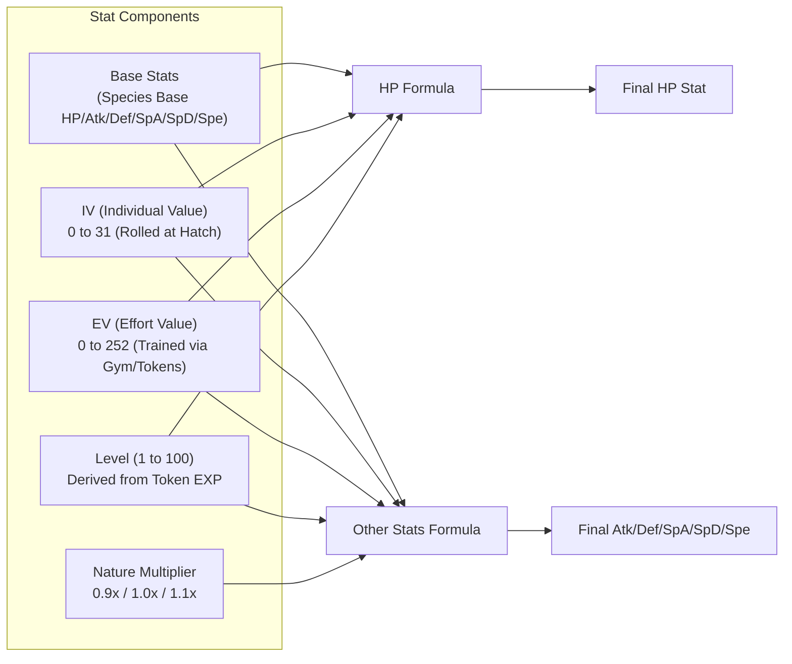
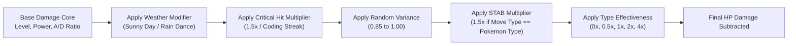
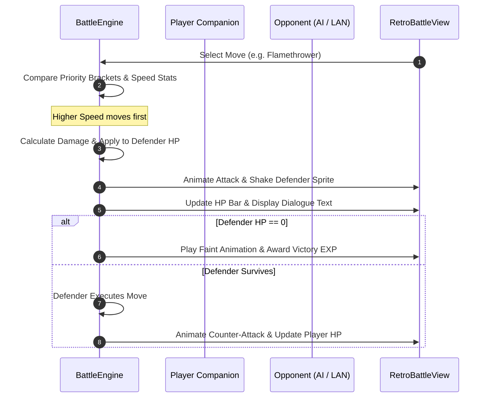

# 🌌 Technical RFC: Far-Future Battle Arena, EV/IV Stats & Combat Mechanics

> **Document Type**: 📜 *Architectural & Research RFC (Request for Comments)*  
> **Target Scope**: Far-Future Milestone (`v1.x` / Exploratory Community RFC)  
> **Status**: 🔬 *Baseline Research & Mathematical Specification*  
> **Language**: [**English / Bahasa Indonesia**](far-future-battle-ev-iv-and-movesets-rfc.md)  

---

## 1. 🎯 Executive Summary & Design Philosophy

Dalam rilis awal **WinTokenMon**, developer memelihara Pokémon pendamping dengan membakar jutaan token AI coding. Untuk memberikan kepuasan puncak dari proses grinding token tersebut, dokumen RFC ini merancang arsitektur sistem **Retro 8-Bit Battle Arena**:
1. **Stat Engine Autentik**: Mengimplementasikan formula perhitungan stat resmi Pokémon (Generasi 3–5) dengan sistem **Individual Values (IVs)**, **Effort Values (EVs)**, dan **Nature Modifiers**.
2. **Formula Kerusakan Standar Kompetitif**: Mengadaptasi *Damage Calculation Formula* standar turnamen (Smogon / Bulbapedia) dengan Physical/Special split, STAB (Same-Type Attack Bonus), dan kalkulasi efektivitas tipe.
3. **Developer Coding Synergies**: Menghubungkan aktivitas koding nyata (misalnya *Git Push Streaks*, *Token Overclock Bursts*, atau *Night Owl Coding*) dengan efek pertempuran in-game (bonus Critical Hit, Weather Buffs, dan elemental power-ups).
4. **100% Offline & Non-Intrusive**: Pertarungan dijalankan secara lokal (PvE melawan AI Gym Leaders) atau via jaringan lokal ringan (Local WiFi LAN P2P) tanpa memerlukan server cloud terpusat.

---

## 2. 📊 Sistem EV, IV, Nature & Rumus Stat Resmi



### A. Individual Values (IVs)
- Setiap Pokémon memiliki 6 nilai IV acak ($0 \to 31$) yang di-*roll* saat telur menetas:
  - $\text{HP}, \text{Attack}, \text{Defense}, \text{Sp. Attack}, \text{Sp. Defense}, \text{Speed}$.
- Nilai IV menentukan potensi bawaan (bakat alami) Pokémon. Pemain dapat memeriksa kualitas IV melalui fitur *"Judge Tool"* di Pokédex.

### B. Effort Values (EVs)
- **Batas EV**: Maksimal **252 EV per stat**, dengan total akumulasi **510 EV** untuk seluruh stat.
- **Mekanisme Latihan (*Developer Gym*)**:
  - Developer dapat mengalokasikan token belanja (*Spendable Tokens*) di menu *"Training Gym"* untuk menaikkan EV tertentu.
  - Setiap $4 \text{ EV}$ bernilai $+1$ poin stat pada Level 100.

### C. Nature Stat Multiplier
Terdapat 25 sifat (*Nature*) Pokémon. Sifat netral bernilai $1.0\times$, sedangkan sifat spesifik memberikan bonus $+10\%$ ($1.1\times$) pada satu stat dan penalti $-10\%$ ($0.9\times$) pada stat lain:

| Nature | Boosted Stat (+10%) | Hindered Stat (-10%) | Coding Vibe Theme |
| :--- | :--- | :--- | :--- |
| **Adamant** | Attack ($\text{Atk}$) | Sp. Attack ($\text{SpA}$) | *Raw Performance / High Output* |
| **Modest** | Sp. Attack ($\text{SpA}$) | Attack ($\text{Atk}$) | *Clean Logic / Algorithmic* |
| **Jolly** | Speed ($\text{Spe}$) | Sp. Attack ($\text{SpA}$) | *Fast Prototyper / Agile* |
| **Timid** | Speed ($\text{Spe}$) | Attack ($\text{Atk}$) | *Quick Refactorer* |
| **Bold** | Defense ($\text{Def}$) | Attack ($\text{Atk}$) | *Defensive / Test-Driven* |
| **Hardy / Serious** | Netral ($1.0\times$) | Netral ($1.0\times$) | *Balanced Developer* |

---

### D. Formula Matematis Kalkulasi Stat (Gen 3+)

Sesuai referensi resmi [Bulbapedia Stat Calculation](https://bulbapedia.bulbagarden.net/wiki/Stat):

#### 1. Formula Perhitungan HP:
$$\text{HP} = \left\lfloor \frac{(2 \times \text{Base}_{\text{HP}} + \text{IV}_{\text{HP}} + \lfloor \frac{\text{EV}_{\text{HP}}}{4} \rfloor) \times \text{Level}}{100} \right\rfloor + \text{Level} + 10$$
*(Pengecualian: Shedinja selalu memiliki HP = 1)*

#### 2. Formula Perhitungan Lima Stat Lainnya ($\text{Atk}, \text{Def}, \text{SpA}, \text{SpD}, \text{Spe}$):
$$\text{Stat} = \left\lfloor \left( \left\lfloor \frac{(2 \times \text{Base} + \text{IV} + \lfloor \frac{\text{EV}}{4} \rfloor) \times \text{Level}}{100} \right\rfloor + 5 \right) \times \text{Nature} \right\rfloor$$

Di mana:
- $\lfloor x \rfloor$ adalah fungsi *floor* (pembulatan ke bawah integer).
- $\text{Nature} \in \{0.9, 1.0, 1.1\}$.

---

## 3. ⚔️ Formula Kerusakan Pertarungan (Damage Calculation Formula)

Sesuai penelitian kompetitif [Smogon Damage Formula Research](https://www.smogon.com/dp/articles/damage_formula) dan [Bulbapedia Damage](https://bulbapedia.bulbagarden.net/wiki/Damage):



### A. Formula Matematis Inti

$$\text{Damage} = \left\lfloor \left( \left\lfloor \frac{\left\lfloor \frac{2 \times \text{Level}}{5} + 2 \right\rfloor \times \text{Power} \times \frac{A}{D}}{50} \right\rfloor + 2 \right) \times \text{Modifier} \right\rfloor$$

Di mana:
- **$\text{Level}$**: Level penyerang saat ini ($1 \to 100$).
- **$\text{Power}$**: Kekuatan dasar jurus (*Base Power*, misal *Flamethrower* = 90, *Thunderbolt* = 90, *Tackle* = 40).
- **$A$ (Attack Stat)**:
  - Menggunakan $\text{Attacker.Attack}$ jika kategori jurus adalah **Physical** (Fisik).
  - Menggunakan $\text{Attacker.SpAttack}$ jika kategori jurus adalah **Special** (Spesial).
- **$D$ (Defense Stat)**:
  - Menggunakan $\text{Defender.Defense}$ untuk jurus **Physical**.
  - Menggunakan $\text{Defender.SpDefense}$ untuk jurus **Special**.

---

### B. Komposisi Nilai Modifier

$$\text{Modifier} = \text{Weather} \times \text{Crit} \times \text{Random} \times \text{STAB} \times \text{Type} \times \text{Burn}$$

| Faktor Modifier | Nilai | Keterangan |
| :--- | :--- | :--- |
| **Weather** | $1.5\times$ / $0.5\times$ / $1.0\times$ | *Sunny Day* memperkuat Fire ($1.5\times$) dan melemahkan Water ($0.5\times$). |
| **Critical Hit** | $1.5\times$ (atau $2.0\times$ dengan perk) | Mengabaikan buff pertahanan lawan. |
| **Random Variance** | $[0.85, 1.00]$ | Variasi acak integer seragam: $\frac{R}{100}$ di mana $R \in [85, 100]$. |
| **STAB (Same-Type Attack Bonus)**| $1.5\times$ ($2.0\times$ dengan Adaptability) | Diberikan jika tipe jurus sama dengan salah satu tipe Pokémon penyerang. |
| **Type Effectiveness** | $0.0\times$, $0.25\times$, $0.5\times$, $1.0\times$, $2.0\times$, $4.0\times$ | Berdasarkan matriks efektivitas 18 tipe Pokémon resmi. |
| **Burn Penalty** | $0.5\times$ | Mengurangi separuh kerusakan jurus fisik jika penyerang terkena status Burn. |

---

### C. Matriks Efektivitas Tipe (18 Elemental Types)

Mengadopsi aturan standar [Bulbapedia Type Matrix](https://bulbapedia.bulbagarden.net/wiki/Type):
- 🔥 **Fire**: Super Efektif ($2\times$) vs 🌿 Grass, ❄️ Ice, 🐛 Bug, ⚙️ Steel; Lemah ($0.5\times$) vs 💧 Water, 🪨 Rock, 🐉 Dragon.
- 💧 **Water**: Super Efektif ($2\times$) vs 🔥 Fire, 🏜️ Ground, 🪨 Rock; Lemah ($0.5\times$) vs 🌿 Grass, 💧 Water, 🐉 Dragon.
- 🌿 **Grass**: Super Efektif ($2\times$) vs 💧 Water, 🏜️ Ground, 🪨 Rock; Lemah ($0.5\times$) vs 🔥 Fire, 🌿 Grass, ☠️ Poison, 🦅 Flying, 🐛 Bug, 🐉 Dragon, ⚙️ Steel.
- ⚡ **Electric**: Super Efektif ($2\times$) vs 💧 Water, 🦅 Flying; Tidak Berdampak ($0\times$) vs 🏜️ Ground.

---

## 4. 🕹️ Sistem Giliran (Turn-Based Battle Loop) & Status Conditions



### A. Penentuan Giliran (*Turn Order & Priority*)
Sesuai standar [Bulbapedia Priority](https://bulbapedia.bulbagarden.net/wiki/Priority):
1. **Priority Bracket**: Jurus dengan prioritas lebih tinggi selalu bergerak duluan:
   - Priority $+1$: *Quick Attack*, *Aqua Jet*, *Mach Punch*.
   - Priority $0$: Sebagian besar jurus standar (*Flamethrower*, *Surf*, *Thunderbolt*).
   - Priority $-6$: *Roar*, *Whirlwind*.
2. **Speed Stat Comparison**: Jika prioritas sama, Pokémon dengan stat $\text{Speed}$ lebih tinggi bergerak lebih dulu. Jika seri (*Speed tie*), pemenang giliran diundi secara acak 50:50.

### B. Kondisi Status (*Status Ailments*)
Sesuai standar [Bulbapedia Status Conditions](https://bulbapedia.bulbagarden.net/wiki/Status_condition):
- 🔥 **Burn ($\text{BRN}$)**: Kehilangan $\frac{1}{16} \text{ Max HP}$ di akhir giliran + output kerusakan jurus Fisik terpotong $-50\%$.
- ⚡ **Paralysis ($\text{PAR}$)**: Stat $\text{Speed}$ berkurang $-50\%$ + peluang $25\%$ gagal menyerang setiap giliran (*fully paralyzed*).
- 💤 **Sleep ($\text{SLP}$)**: Tidak dapat menyerang selama $1 \to 3$ giliran acak.
- ☠️ **Poison ($\text{PSN}$)**: Kehilangan $\frac{1}{8} \text{ Max HP}$ di akhir setiap giliran.
- ❄️ **Freeze ($\text{FRZ}$)**: Membeku tidak bisa bergerak dengan peluang $20\%$ mencair setiap giliran.

---

## 5. 💡 Movesets & Integrasi Sinergi Koding (Developer Synergies)

### A. 4 Slot Jurus & Struktur Data
Setiap Pokémon dapat menguasai hingga 4 jurus aktif:

```python
@dataclass
class Move:
    id: str                 # e.g. "flamethrower"
    name: str               # "Flamethrower"
    element_type: str       # "Fire"
    category: str           # "Physical" | "Special" | "Status"
    base_power: int         # 90
    accuracy: int           # 100 (%)
    max_pp: int             # 15 (Power Points)
    current_pp: int
    priority: int = 0
    effect_chance: float = 0.10 # 10% burn chance
```

---

### B. Sinergi Koding Nyata (*Real-World Developer Synergies*)

WinTokenMon menghadirkan mekanik unik di mana aktivitas koding developer di dunia nyata memberikan buff taktis pada pertarungan:

```
+-----------------------------------------------------------------------------------+
| 🌟 DEVELOPER CODING SYNERGIES                                                     |
+-----------------------------------------------------------------------------------+
| 1. 🚀 Git Push Streak (>= 3 Days)      -> +25% Critical Hit Chance               |
| 2. ⚡ Token Overclock (>1M Tokens)     -> Auto-weather on entry (Sun/Rain/Terrain)|
| 3. 🦉 Night Owl Session (00:00-05:00)  -> +20% Power on Dark & Ghost Moves        |
| 4. 🧹 0-Linter Error Streak (Ruff Clean) -> +10% Accuracy on All Moves            |
| 5. 🍬 High Friendship (>= 80%)         -> 15% Chance to endure lethal hit with 1HP|
+-----------------------------------------------------------------------------------+
```

---

## 6. 🌐 Mode Pertarungan (Game Modes)

### Mode 1: PvE AI Gym Leaders (Single Player Progression)
Developer menantang serangkaian Gym Leader bertema rekayasa perangkat lunak:

| Gym Leader | Spesialisasi Tipe | Level Boss | Hadiah Kemenangan |
| :--- | :--- | :--- | :--- |
| 🐛 **Junior Bug Catcher Timmy** | 🐛 Bug / 🌿 Grass | Lv. 15 | 🪙 5M Tokens + *Bug Tracker Badge* |
| ⚡ **DevOps Engineer Volt** | ⚡ Electric / ⚙️ Steel | Lv. 35 | 🍬 2x Rare Candies + *CI/CD Badge* |
| 🧠 **Algorithm Master Sabrina** | 🔮 Psychic / 👻 Ghost | Lv. 55 | 🌿 3x Nature Mints + *Big-O Badge* |
| 👑 **Tech Lead Champion Red** | 🔥 Fire / 🐉 Dragon / 💧 Water | Lv. 75 | 🏆 *Staff Principal Trophy* + Shiny Charm |

---

### Mode 2: Local LAN P2P PvP (Zero Cloud, Zero Setup)
- **Komunikasi Jaringan**: Berjalan di atas socket TCP port `49152` pada subnet lokal yang sama.
- **Protokol P2P Ringan**:
  - Broadcast UDP beacon untuk mendeteksi rekan kerja di WiFi yang sama: `{"app": "WinTokenMon", "trainer": "Alice", "pokemon": "Charizard", "level": 50}`.
  - Saat tantangan diterima, kedua laptop bertukar seed RNG acak deterministik dan input pilihan jurus secara terenkripsi.

---

## 7. 🎨 Mockup UI Retro 8-Bit Battle Window

```
+-------------------------------------------------------------------------------+
|  ⚔️ WINTOKENMON BATTLE ARENA — PVE GYM BATTLE                                  |
+-------------------------------------------------------------------------------+
|                                                                               |
|                      [OPPONENT SPRITE]        TECH LEAD RED                   |
|                      🔥 Charizard (Lv. 50)    HP: [====================] 100% |
|                                                                               |
|  DEVELOPER ALICE                                                              |
|  💧 Blastoise (Lv. 52)                                                        |
|  HP: [==============......] 72/145                                            |
|  EXP: [==================..] 88%                                              |
|  [PLAYER BACK SPRITE]                                                         |
|                                                                               |
+-------------------------------------------------------------------------------+
|  What will BLASTOISE do?                                                      |
|  +-----------------------------------+-------------------------------------+  |
|  | [1] 💧 Hydro Pump (PP 5/5)         | [2] ❄️ Ice Beam (PP 10/10)          |  |
|  | [3] ⚪ Skull Bash (PP 10/10)       | [4] 🛡️ Protect (PP 10/10)           |  |
|  +-----------------------------------+-------------------------------------+  |
|  [ 🏃 Forfeit / Run Away ]             [ 🍬 Use Bag Item in Battle ]          |
+-------------------------------------------------------------------------------+
```

---

## 8. 🛡️ Mitigasi Risiko Teknis, Performa & Legal Fair-Use

1. **Efisiensi Performa & Memori**:
   - Canvas render battle menggunakan sprite GIF 2D standar yang sudah ter-cache secara lokal di `assets/`.
   - Overhead memori modul battle: $< 15\text{MB}$ RAM.
   - Tidak membebani background token reader karena battle berjalan di window terpisah saat pengguna memilih untuk bertarung.
2. **Kepatuhan Legal Fair Use**:
   - Seluruh nama Pokémon, sprite, dan audio cry digunakan semata-mata di bawah prinsip pembelajaran non-komersial (*Non-Commercial Educational & Fair-Use Gaming Companion*).
   - Kode proyek didistribusikan secara Open Source di bawah Lisensi MIT.

---

## 9. 📖 Referensi Riset & Literatur Komunitas

Untuk rujukan teknis, formula, dan data parameter lengkap, silakan merujuk pada sumber riset resmi berikut:

1. **Bulbapedia Mechanics Guides**:
   - [Bulbapedia: Complete Damage Calculation Formula](https://bulbapedia.bulbagarden.net/wiki/Damage)
   - [Bulbapedia: Stat Determination Formulas (IV, EV, Nature)](https://bulbapedia.bulbagarden.net/wiki/Stat)
   - [Bulbapedia: Individual Values (IVs)](https://bulbapedia.bulbagarden.net/wiki/Individual_values)
   - [Bulbapedia: Effort Values (EVs)](https://bulbapedia.bulbagarden.net/wiki/Effort_values)
   - [Bulbapedia: Nature Stat Modifiers](https://bulbapedia.bulbagarden.net/wiki/Nature)
   - [Bulbapedia: 18-Type Effectiveness Matrix](https://bulbapedia.bulbagarden.net/wiki/Type)
   - [Bulbapedia: Move Priority & Speed Brackets](https://bulbapedia.bulbagarden.net/wiki/Priority)
   - [Bulbapedia: Status Conditions & Non-Volatile Ailments](https://bulbapedia.bulbagarden.net/wiki/Status_condition)
2. **Smogon University Research**:
   - [Smogon: In-Depth Damage Formula & Arithmetic Derivation](https://www.smogon.com/dp/articles/damage_formula)
3. **Pokémon Showdown Open-Source Simulator**:
   - [Showdown Sim Engine Source Code (`sim/battle.ts`, `sim/dex-data.ts`)](https://github.com/smogon/pokemon-showdown)
4. **PokéAPI REST API**:
   - [PokéAPI: Endpoints Documentation for Stats, Moves, and Types](https://pokeapi.co/docs/v2)
