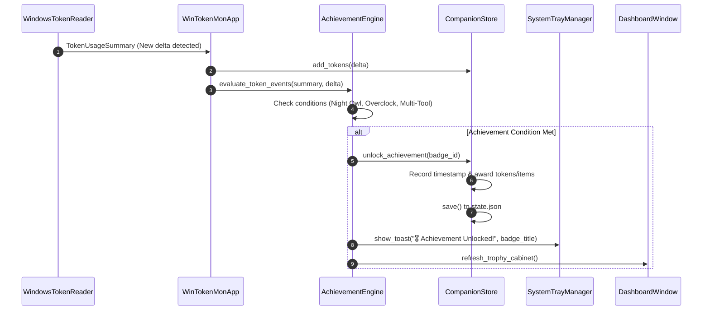

# Implementation Plan: Developer Achievements & Badges Framework (`v0.2.0`)

> **Milestone**: `v0.2.0`  
> **Status**: 📝 *Approved Architecture Design*  
> **Target Release**: Q3 2026  
> **Estimated Effort**: 3–4 Days  

---

## 1. 🎯 Executive Summary & Problem Context

Dalam versi `v0.1.0-beta`, pengguna membakar jutaan token AI untuk menetaskan dan menaikkan level Pokémon mereka. Namun, sistem saat ini belum memiliki pengakuan (*recognition*) eksplisit terhadap kebiasaan koding developer tertentu—seperti maraton koding larut malam (*Night Owl*), lonjakan koding intensif (*Token Overclock*), atau diversifikasi penggunaan multi-alat AI (*Multi-Tool Wizard*).

**Tujuan Milestone `v0.2.0`**:
Membangun **Developer Achievements & Badges Framework** yang mengevaluasi perilaku koding secara otomatis di latar belakang, memberikan lencana prestasi retro dengan visual hologram, menghadiahkan mata uang spendable token / Rare Candy, memunculkan notifikasi Windows Toast native, dan menyediakan tab **Trophy Cabinet 🏆** interaktif di Dashboard.

---

## 2. 🔍 Scope of Changes (In-Scope vs. Out-of-Scope)

### ✅ In-Scope
1. **Engine Evaluasi Modular (`core/achievement_engine.py`)**:
   - Event hook non-blocking saat polling token dan saat event game terjadi (`ON_TOKEN_POLL`, `ON_EGG_HATCH`, `ON_EVOLVE`, `ON_SHOP_PURCHASE`).
   - 8 Lencana Prestasi Inti:
     - 🦉 **Night Owl Coder**: Konsumsi $>100\text{k}$ token antara pukul 00:00 – 05:00 waktu lokal. (Hadiah: 🪙 5M Spendable Tokens).
     - ⚡ **Token Overclock**: Bakar $>1\text{M}$ token dalam kurun waktu 60 menit. (Hadiah: 🍬 1x Rare Candy).
     - 🐣 **First Hatch**: Menetaskan telur Pokémon pertama. (Hadiah: 🪙 10M Spendable Tokens).
     - ✨ **Shiny Hunter**: Menetaskan varian Shiny pertama. (Hadiah: ✨ 1x Shiny Charm).
     - 🧙‍♂️ **Multi-Tool Wizard**: Membakar token pada 3+ tools AI berbeda dalam 1 hari. (Hadiah: 🌿 2x Nature Mints).
     - 💯 **100M Burn Club**: Akumulasi $100\text{M}$ total lifetime token. (Hadiah: 🏅 Gold Profile Hologram Badge).
     - 🎓 **Senior Professor**: Meluluskan (*graduate*) 5 Pokémon ke status Senior. (Hadiah: 🍬 5x Rare Candies).
     - 🥚 **Egg Hoarder**: Membeli seluruh Tier Telur di Shop. (Hadiah: 🪙 50M Spendable Tokens).
2. **State & Persistence Layer (`core/companion_store.py`)**:
   - Menyimpan `unlocked_achievements: dict[str, float]` (ID -> timestamp unlock).
   - Menyimpan `achievement_progress: dict[str, float]` (ID -> nilai progres $0.0 \to 1.0$).
   - Migrasi state otomatis untuk pengguna lama berdasarkan riwayat lifetime.
3. **UI Presentation Layer (`ui/dashboard.py` & `ui/system_tray.py`)**:
   - Tab baru **"Trophies 🏆"** di Dashboard dengan grid kartu badge (emas/perak/perunggu), bilah progres, dan filter (All / Unlocked / Locked).
   - Windows Native Toast balloon saat achievement terbuka.
   - Efek suara chiptune khusus unlock.

### ❌ Out-of-Scope (Deferred to Later Milestones)
- Integrasi leaderboard global cloud / PvP (WinTokenMon berkomitmen 100% offline & private).
- Kustomisasi badge berbasis SVG eksternal dari internet.

---

## 3. 📐 Technical Architecture & Sequence Diagrams



---

## 4. 💾 State Engine & Schema Migration (`state.json`)

### Format Skema Baru
```json
{
  "active": { ... },
  "pokedex": { ... },
  "unlocked_achievements": {
    "night_owl": 1723881200.0,
    "first_hatch": 1723884500.0
  },
  "achievement_progress": {
    "100m_burn_club": 0.425,
    "senior_professor": 0.40
  }
}
```

### Logika Migrasi Backward Compatibility
Saat memuat `state.json` lama (yang belum memiliki field `unlocked_achievements`):
1. Jika `total_tokens_burned_lifetime >= 100_000_000` $\to$ Buka otomatis `100m_burn_club`.
2. Jika jumlah `pokedex` $\ge 1$ dan `active` bukan `None` $\to$ Buka otomatis `first_hatch`.
3. Jika terdapat Pokémon Shiny di dalam `pokedex` $\to$ Buka otomatis `shiny_hunter`.

---

## 5. ⚠️ Failure Modes, Edge Cases & Risk Mitigations

| Skenario Risiko / Edge Case | Dampak | Strategi Mitigasi Teknis |
| :--- | :--- | :--- |
| **Timezone / Clock Drift** | Badge *Night Owl* terbuka di luar jam semestinya jika PC menggunakan jam UTC tanpa offset lokal. | Gunakan `time.localtime()` Windows lokal eksplisit dan bandingkan `tm_hour in range(0, 5)`. |
| **Double Reward Claim Glitch** | Polling token yang cepat memicu unlock dua kali dan menggandakan reward item. | Pengecekan idempotency: `if badge_id in self.unlocked_achievements: return False` sebelum menambah reward. |
| **Multi-Tool Detection False Positive** | AI tools yang tidak aktif dihitung sebagai aktif. | Evaluasi hanya tool yang memiliki `tokens_today > 0` pada hari tanggal lokal yang sama. |
| **Heavy Token Burst Loop** | Evaluasi ratusan achievement memperlambat thread utama UI. | Jalankan `AchievementEngine.evaluate()` secara O(1) per event menggunakan hash map filter. |

---

## 6. ⚡ Performance & Memory Budget Impact

- **RAM Overhead**: $< 2\text{MB}$ untuk cache metadata 15–20 badge.
- **CPU Overhead**: $< 0.1\%$ per siklus polling 10 detik. Evaluasi kondisi menggunakan operasi aritmatika integer dasar.
- **Disk I/O**: Hanya menulis ke `state.json` ketika ada achievement baru yang terbuka.

---

## 7. 🛠️ Code Structure & Method Signatures

### `core/models.py`
```python
from dataclasses import dataclass
from enum import Enum
from typing import Optional

class BadgeTier(Enum):
    BRONZE = "bronze"
    SILVER = "silver"
    GOLD = "gold"
    PLATINUM = "platinum"

@dataclass
class AchievementDef:
    id: str
    title: str
    description: str
    tier: BadgeTier
    icon_emoji: str
    reward_tokens: int = 0
    reward_item: Optional[str] = None
    reward_item_count: int = 0
```

### `core/achievement_engine.py`
```python
class AchievementEngine:
    def __init__(self, store: CompanionStore):
        self.store = store
        self.hourly_token_history: deque[tuple[float, int]] = deque(maxlen=360) # 1 hour rolling

    def on_token_poll(self, delta: int, summary: TokenUsageSummary) -> list[AchievementDef]:
        """Evaluates time-based and volume-based achievements."""
        ...

    def on_game_event(self, event_type: str, context: dict) -> list[AchievementDef]:
        """Evaluates hatch, evolve, and shop purchase events."""
        ...
```

---

## 8. 🧪 Automated Testing Strategy (`tests/test_achievements.py`)

1. `test_night_owl_trigger_during_midnight_hours`: Mocking waktu lokal ke pukul 02:30, assert badge terbuka.
2. `test_night_owl_does_not_trigger_during_day`: Mocking waktu ke 14:00, assert badge tetap terkunci.
3. `test_token_overclock_one_hour_window`: Simulasi delta 1.2M token dalam 45 menit, assert reward Rare Candy bertambah 1.
4. `test_idempotent_achievement_unlock`: Memanggil unlock 5 kali berturut-turut, assert reward hanya diberikan tepat 1 kali.
5. `test_backward_compatibility_migration`: Memuat state lama dengan 120M token, assert `100m_burn_club` langsung terbuka saat init.

---

## 9. 📋 Implementation Phases & Acceptance Checklist

- [ ] **Fasa 1: Data Model & Engine Core**: Buat `core/achievement_engine.py` dan definisikan 8 badge inti.
- [ ] **Fasa 2: State Store Binding**: Tambahkan `unlocked_achievements` dan logika migrasi di `core/companion_store.py`.
- [ ] **Fasa 3: UI Trophy Cabinet**: Bangun tab Trophy Cabinet di `ui/dashboard.py` dengan grid kartu dan filter status.
- [ ] **Fasa 4: Audio & Toast Integration**: Pasang hook notifikasi toast native di `ui/system_tray.py` dan audio fanfare.
- [ ] **Fasa 5: Unit Tests & Verifikasi**: Tulis 10+ unit test di `tests/test_achievements.py`, pastikan `pytest` dan `ruff` lulus 100%.
