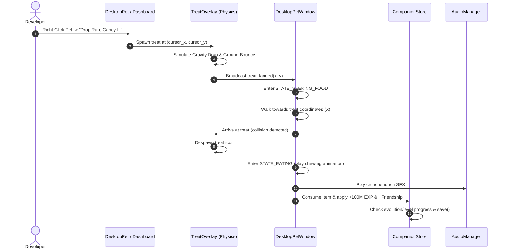

# Implementation Plan: Interactive Desktop Feeding & Friendship Mechanics (`v0.3.0`)

> **Milestone**: `v0.3.0`  
> **Status**: 📝 *Approved Architecture Design*  
> **Target Release**: Q4 2026  
> **Estimated Effort**: 4–5 Days  

---

## 1. 🎯 Executive Summary & Problem Context

Dalam versi `v0.1.0-beta`, item seperti **Rare Candy** dan **Nature Mint** hanya digunakan secara statis melalui tombol di Dashboard UI. Pet di desktop bergerak secara otonom (*roaming*), tetapi belum memiliki interaksi fisik langsung dengan objek di layar atau hubungan kasih sayang (*Friendship*) yang dapat dipupuk oleh developer.

**Tujuan Milestone `v0.3.0`**:
Menghadirkan pengalaman interaktif ala *Virtual Pet Shimeji*:
1. **Direct Treat Dropping**: Pengguna dapat menjatuhkan Berry atau Rare Candy ke desktop dari menu konteks pet atau tab Bag. Treat jatuh dengan gravitasi fisik ringan, memantul di layar, dan memicu pet untuk berbalik arah, berjalan menghampiri makanan (*pathfinding & walking gait*), dan memakannya (`😋` / `✨`).
2. **Friendship & Affection Meter**: Mengelus atau berinteraksi dengan pet menaikkan bilah kasih sayang ($0 \to 100\%$), membuka animasi eksklusif (*happy backflips*, *cuddle naps*), dan memberikan boost pasif terhadap exp hatching.

---

## 2. 🔍 Scope of Changes (In-Scope vs. Out-of-Scope)

### ✅ In-Scope
1. **Fisika Gravitasi & Drop Treat (`ui/treat_overlay.py`)**:
   - Window transparan ringan untuk merender treat jatuh dengan gravitasi ($Y = Y_0 + \frac{1}{2}gt^2$) dan pantulan redaman (*damped bounce*).
   - Treat tetap berada di koordinat lantai taskbar sampai dimakan atau kadaluarsa (timeout 30 detik).
2. **Pet Pathfinding & Eating Sequence (`ui/desktop_pet.py`)**:
   - Status pet baru: `STATE_SEEKING_FOOD` dan `STATE_EATING`.
   - Pet menghitung vektor jarak ke treat di layar, mengubah orientasi hadap (kiri/kanan), berjalan dengan fisika langkah (*walking hop physics*), lalu memainkan animasi makan (`😋` + partikel kilau).
3. **Friendship Engine & Affection Meter (`core/companion_store.py`)**:
   - Penambahan parameter `friendship: int` ($0 \to 100$) per companion.
   - Peningkatan friendship harian via:
     - Mengelus pet dengan kursor mouse (+5% per hari).
     - Memberi makan Rare Candy / Berries (+15% per treat).
     - Membakar >1M token bersama companion (+10% per hari).
   - Manfaat Friendship Tinggi ($\ge 80\%$): Bonus +10% efisiensi token exp dan animasi ceria eksklusif.
4. **UI Dashboard & Context Menu (`ui/dashboard.py` & `ui/desktop_pet.py`)**:
   - Tombol *"Drop Treat to Desktop 🍬"* di tab Inventory.
   - Menu klik kanan pada pet: *"Feed Treat..."* $\to$ *"Drop Rare Candy"*.

### ❌ Out-of-Scope
- Sistem kelaparan (*starvation*) yang menghukum atau membunuh Pokémon jika tidak diberi makan (kita ingin menjaga nuansa koding yang menyenangkan tanpa stres atau rasa bersalah).
- Minigame kompleks berbasis kontrol keyboard (cukup interaksi mouse & cursor).

---

## 3. 📐 Technical Architecture & Sequence Diagrams



---

## 4. 💾 State Engine & Schema Migration (`state.json`)

### Format Skema Baru
```json
{
  "active": {
    "species_id": 4,
    "species_name": "Charmander",
    "stage_index": 0,
    "friendship": 75,
    "last_pet_date": "2026-08-17",
    "treats_eaten_today": 2
  },
  "inventory": {
    "rare_candy": 2,
    "berry_oran": 5
  }
}
```

### Logika Migrasi Backward Compatibility
Saat memuat `state.json` lama:
- Jika `friendship` tidak ditemukan pada `active`, inisialisasi default ke `50` (Neutral/Friendly).
- Field `last_pet_date` diisi string kosong `""`.

---

## 5. ⚠️ Failure Modes, Edge Cases & Risk Mitigations

| Skenario Risiko / Edge Case | Dampak | Strategi Mitigasi Teknis |
| :--- | :--- | :--- |
| **Treat Jatuh ke Luar Layar (Multi-Monitor)** | Treat jatuh di koordinat virtual yang tidak terlihat, membuat pet berjalan tanpa henti ke ujung layar. | Batasi koordinat drop treat secara ketat di dalam *workarea* monitor tempat pet berada saat ini (`GetSystemMetrics` / `winfo_screenwidth`). |
| **User Menjatuhkan 10 Treat Sekaligus** | Animasi dan antrian pathfinding bertumpuk dan lag. | Batasi maksimal **2 treat aktif** di layar secara bersamaan. Tombol drop dinonaktifkan sementara jika kuota penuh. |
| **Pet Tersangkut Saat Menuju Makanan** | Pet macet di batas layar jika treat berada di posisi yang tidak dapat dijangkau. | Pasang timeout pathfinding 10 detik. Jika dalam 10 detik belum sampai, pet membatalkan pencarian dan treat otomatis terserap. |
| **Window Lag / Framerate Drop** | Overlay jendela treat tambahan membebani memori render Tkinter. | Render treat langsung di kanvas overlay jendela pet transparan yang sudah ada tanpa membuat top-level baru. |

---

## 6. ⚡ Performance & Memory Budget Impact

- **FPS Target**: Tetap 60 FPS pada animasi gravitasi treat (dihitung via interval `after(16)` ms).
- **RAM Overhead**: $< 3\text{MB}$ tambahan untuk sprite treat dan koordinat state.
- **CPU Overhead**: $< 0.2\%$ selama 2 detik animasi jatuh treat. Nol CPU saat diam.

---

## 7. 🛠️ Code Structure & Method Signatures

### `core/models.py`
```python
@dataclass
class TreatItem:
    kind: str  # "rare_candy", "berry_oran"
    exp_boost: int
    friendship_boost: int
    sprite_name: str
```

### `ui/desktop_pet.py`
```python
class DesktopPetWindow:
    def drop_treat(self, item_kind: str, start_x: int, start_y: int):
        """Spawns falling treat on desktop and directs pet pathfinding."""
        ...

    def _update_food_seeking_ai(self):
        """Directs pet walking towards the active treat coordinates."""
        ...

    def _play_eating_animation(self, treat: TreatItem):
        """Displays eating particle effects and consumes item."""
        ...
```

---

## 8. 🧪 Automated Testing Strategy (`tests/test_feeding.py`)

1. `test_friendship_increment_from_petting`: Simulasi interaksi petting, assert `friendship` bertambah +5 dan capped di 100.
2. `test_treat_consumption_grants_exp_and_friendship`: Simulasi pemakanan Rare Candy, assert spendable EXP dan friendship bertambah.
3. `test_pathfinding_target_coordinates`: Assert pet orientasi hadap (flip X) menghadap ke arah koordinat treat.
4. `test_daily_friendship_cap_limit`: Assert petting berulang-ulang di hari yang sama tidak menaikkan friendship lebih dari limit harian (+20%).

---

## 9. 📋 Implementation Phases & Acceptance Checklist

- [ ] **Fasa 1: Friendship State Engine**: Tambahkan field `friendship` dan metode interaksi di `core/companion_store.py`.
- [ ] **Fasa 2: Treat Physics & Animation**: Buat fungsi simulasi gravitasi dan rendering sprite treat di `ui/desktop_pet.py`.
- [ ] **Fasa 3: Pet Pathfinding AI**: Implementasikan state `STATE_SEEKING_FOOD` dan logika jalan menghampiri makanan.
- [ ] **Fasa 4: Context Menu & Bag Drop**: Tambahkan opsi *"Drop Treat"* di klik kanan pet dan tombol di tab Bag.
- [ ] **Fasa 5: Unit Tests & Verifikasi**: Tulis test suite di `tests/test_feeding.py`, pastikan lulus 100%.
