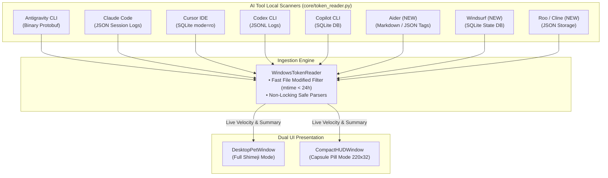

# Implementation Plan: Extended AI Provider Scanners & Compact HUD Pill Mode (`v0.4.0`)

> **Milestone**: `v0.4.0`  
> **Status**: 📝 *Approved Architecture Design*  
> **Target Release**: Q1 2027  
> **Estimated Effort**: 4–5 Days  

---

## 1. 🎯 Executive Summary & Problem Context

Dalam versi `v0.1.0-beta`, WinTokenMon mendukung 5 provider AI utama (*Antigravity CLI, Claude Code, Cursor IDE, Codex CLI, dan GitHub Copilot CLI*). Namun ekosistem AI coding berkembang sangat pesat dengan hadirnya alat-alat populer seperti **Aider**, **Windsurf (Cascade)**, **Roo Code**, dan **Cline**.

Selain itu, beberapa developer menginginkan opsi tampilan minimalis yang tidak menutupi kode mereka sama sekali—sebuah mode kapsul mengambang (**Ultra-Compact Floating HUD Pill**, $220 \times 32\text{px}$) yang menampilkan kecepatan konsumsi token (*speedometer / burn velocity*) secara real-time.

**Tujuan Milestone `v0.4.0`**:
1. Menambahkan scanner lokal non-locking untuk **Aider**, **Windsurf (Cascade)**, **Roo Code**, dan **Cline**.
2. Membangun mode tampilan baru: **Ultra-Compact Floating HUD Capsule** yang dapat di-snap ke tepi layar / taskbar dan dapat berganti mode (*toggle*) secara instan dengan Desktop Pet biasa.

---

## 2. 🔍 Scope of Changes (In-Scope vs. Out-of-Scope)

### ✅ In-Scope
1. **Extended AI Token Readers (`core/token_reader.py`)**:
   - **Aider**: Parse markdown history `~/.aider.chat.history.md` dan cache tokens di `.aider.tags.cache.v3`.
   - **Windsurf (Cascade by Codeium)**: Parse database SQLite `%APPDATA%\Windsurf\User\workspaceStorage\*\state.vscdb` (menggunakan query non-locking URI `mode=ro`).
   - **Roo Code (Roo Cline)**: Parse JSON session storage di `%APPDATA%\Code\User\globalStorage\rooveterinaryinc.roo-cline\`.
   - **Cline (VS Code)**: Parse JSON task logs di `%APPDATA%\Code\User\globalStorage\saoudrizwan.claude-dev\`.
2. **Compact HUD Pill Window (`ui/compact_hud.py`)**:
   - Jendela floating semi-transparan berbentuk kapsul hitam elegan ($220 \times 32\text{px}$).
   - Elemen Informasi:
     - 🪙 Token Terbakar Hari Ini & Total Budget (misal: `🔥 142.5k / 2.5M (5.7%)`).
     - ⚡ Speedometer Kecepatan Token (*Velocity*: `tokens/min`).
     - 🥚 / 🐾 Icon Mini Companion aktif + status EXP.
     - Tombol cepat untuk beralih kembali ke Mode Pet Penuh.
   - Pilihan Docking: Terapung bebas (*draggable*), atau menempel (*docked*) di atas taskbar dekat jam Windows.
3. **Switch Mode Integration (`main.py` & `ui/system_tray.py`)**:
   - Opsi Tray Menu: *"Mode: Full Pet Mode"* $\leftrightarrow$ *"Mode: Compact HUD Pill"*.
   - Hotkey / Klik ganda pada pet untuk beralih mode.

### ❌ Out-of-Scope
- Membaca prompt chat teks atau kode sumber pengguna (hanya mengekstrak angka integer token input/output).
- Cloud API scraping yang memerlukan login atau API key.

---

## 3. 📐 Technical Architecture & Sequence Diagrams



---

## 4. 💾 State Engine & Schema Migration (`state.json`)

### Format Skema Baru
```json
{
  "active": { ... },
  "display_mode": "full_pet", // "full_pet" atau "compact_hud"
  "hud_position": { "x": 1600, "y": 980 },
  "hud_opacity": 90,
  "tracked_providers": {
    "aider_enabled": true,
    "windsurf_enabled": true,
    "cline_enabled": true
  }
}
```

### Logika Migrasi Backward Compatibility
Saat memuat `state.json` lama:
- `display_mode` default ke `"full_pet"`.
- Provider baru otomatis di-enable secara default jika folder path-nya terdeteksi di mesin Windows.

---

## 5. ⚠️ Failure Modes, Edge Cases & Risk Mitigations

| Skenario Risiko / Edge Case | Dampak | Strategi Mitigasi Teknis |
| :--- | :--- | :--- |
| **Windsurf SQLite File Locked saat Koding** | Error `sqlite3.OperationalError: database is locked`. | Selalu buka koneksi menggunakan SQLite URI: `sqlite3.connect('file:...' + '?mode=ro', uri=True)` dengan timeout 1 detik. |
| **Workspace Storage VS Code Memiliki 100+ Folder** | Polling lambat karena scanning direktori rekursif yang dalam. | Filter cepat: Hanya periksa sub-folder yang `os.path.getmtime(folder)` berubah dalam kurun 24 jam terakhir. Lewati folder proyek yang tidak disentuh hari ini. |
| **Log Format Aider Berubah di Versi Baru** | Parser crash saat format teks markdown berubah. | Bungkus parser Aider dalam blok `try-except` toleran. Gunakan regex fleksibel `r"tokens?:\s*([0-9,]+)"` dengan fallback 0 token jika format tidak cocok. |
| **HUD Menutupi Tombol Taskbar Windows** | HUD menghalangi klik pada System Tray Windows. | Sediakan margin 8px dari taskbar dan buat HUD dapat digeser (*drag*) ke sudut mana saja di layar. |

---

## 6. ⚡ Performance & Memory Budget Impact

- **Waktu Scanning Multi-Provider**: $< 15\text{ms}$ total per siklus polling 10 detik (berkat filter `mtime`).
- **RAM Overhead Compact HUD**: $< 5\text{MB}$ (lebih ringan daripada mode Full Pet).
- **CPU Overhead**: $< 0.1\%$ rata-rata.

---

## 7. 🛠️ Code Structure & Method Signatures

### `core/token_reader.py` (Penambahan Scanner)
```python
class WindowsTokenReader:
    def _read_aider_tokens(self) -> ProviderUsage:
        """Parses Aider markdown history and tag cache."""
        ...

    def _read_windsurf_tokens(self) -> ProviderUsage:
        """Queries Windsurf Cascade workspace storage SQLite databases."""
        ...

    def _read_cline_and_roo_tokens(self) -> ProviderUsage:
        """Parses Roo Code and Cline JSON global session logs."""
        ...
```

### `ui/compact_hud.py`
```python
class CompactHUDWindow:
    def __init__(self, store: CompanionStore, on_switch_mode: Callable):
        self.win = tk.Toplevel()
        self.win.overrideredirect(True)  # Frameless
        self.win.attributes("-topmost", True)
        self.win.attributes("-alpha", 0.9)
        ...

    def update_metrics(self, summary: TokenUsageSummary, velocity_per_min: float):
        """Updates live velocity speedometer and progress percentage."""
        ...
```

---

## 8. 🧪 Automated Testing Strategy (`tests/test_extended_scanners.py`)

1. `test_aider_markdown_parser`: Mocking file `.aider.chat.history.md` dengan fixture token input/output, assert token terbaca akurat.
2. `test_windsurf_sqlite_ro_query`: Mocking file `state.vscdb` sqlite dummy, assert query `mode=ro` mengembalikan token tanpa lock error.
3. `test_cline_json_log_parser`: Mocking file JSON Cline task, assert token akumulatif dihitung tepat.
4. `test_compact_hud_velocity_calculation`: Simulasi delta token dalam 60 detik, assert kecepatan `tokens_per_min` terhitung presisi.

---

## 9. 📋 Implementation Phases & Acceptance Checklist

- [ ] **Fasa 1: Aider & Windsurf Parsers**: Implementasikan method pembaca token Aider & Windsurf di `core/token_reader.py`.
- [ ] **Fasa 2: Roo Code & Cline Parsers**: Implementasikan parser JSON storage untuk Roo Code & Cline.
- [ ] **Fasa 3: Compact HUD UI**: Bangun `ui/compact_hud.py` dengan render kapsul minimalis dan speedometer.
- [ ] **Fasa 4: Mode Switcher**: Hubungkan toggle mode antara Full Pet dan Compact HUD di Tray & mainloop.
- [ ] **Fasa 5: Unit Tests & Verifikasi**: Tulis unit test di `tests/test_extended_scanners.py`, pastikan lulus 100%.
