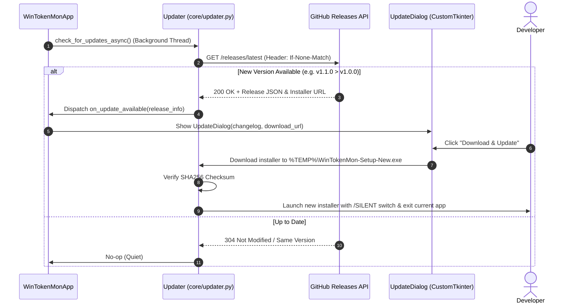

# Implementation Plan: Production Release, Winget Distribution & Auto-Update Engine (`v1.0.0`)

> **Milestone**: `v1.0.0` (Production General Availability)  
> **Status**: 📝 *Approved Architecture Design*  
> **Target Release**: Q2 2027  
> **Estimated Effort**: 3–4 Days  

---

## 1. 🎯 Executive Summary & Problem Context

Dalam rilis beta `v0.1.0-beta`, pengujian dan distribusi dilakukan dengan mengompilasi installer Inno Setup secara lokal (`scripts/build_installer.py`). Untuk mencapai rilis produksi **`v1.0.0`** yang siap dinikmati ribuan developer di seluruh dunia:
1. Pengguna harus dapat menginstal aplikasi dalam 1 baris perintah terminal melalui **Windows Package Manager (`winget install WinTokenMon`)**.
2. Aplikasi harus memiliki kemampuan **Background Auto-Update Check** yang memeriksa rilis GitHub resmi dan memberi notifikasi update 1-klik yang aman tanpa merusak save game.
3. Seluruh proses pembuatan installer, verifikasi hash SHA256, dan draft rilis GitHub harus diotomatisasi secara penuh melalui **GitHub Actions Matrix CI/CD**.

---

## 2. 🔍 Scope of Changes (In-Scope vs. Out-of-Scope)

### ✅ In-Scope
1. **Windows Package Manager (Winget) Integration (`winget/`)**:
   - Struktur manifest standar Winget:
     - `manifests/w/WinTokenMon/WinTokenMon/1.0.0/WinTokenMon.WinTokenMon.yaml`
     - `WinTokenMon.WinTokenMon.installer.yaml` (URL release GitHub, SHA256 hash, Inno Setup switches).
     - `WinTokenMon.WinTokenMon.locale.en-US.yaml` (Deskripsi, tags, lisensi MIT).
   - Script otomatisasi pembuatan manifest: `scripts/generate_winget_manifest.py`.
2. **In-App Auto-Updater Subsystem (`core/updater.py`)**:
   - Pengecekan versi baru ke GitHub Releases API (`https://api.github.com/repos/.../releases/latest`) setiap 24 jam sekali saat startup.
   - Pengecekan non-blocking di thread latar belakang (tidak memperlambat startup UI).
   - Dialog pembaruan modern: Menampilkan changelog rilis baru dan tombol *"Download & Install Now"* atau *"Remind Me Later"*.
   - Saat di-update, save game `%APPDATA%\WinTokenMon\state.json` **dijamin 100% aman dan tidak terhapus**.
3. **CI/CD Automated Release Matrix (`.github/workflows/release.yml`)**:
   - Terpicu secara otomatis saat Git Tag `v*.*.*` di-push.
   - Menjalankan `pytest` dan `ruff`.
   - Mengompilasi PyInstaller `.exe` dan Inno Setup `.exe` pada runner `windows-latest`.
   - Menghitung `SHA256` checksum file setup.
   - Mengunggah binary ke GitHub Release Assets.

### ❌ Out-of-Scope
- Silent Background Auto-Patching tanpa izin pengguna (kita memprioritaskan transparansi; update selalu meminta konfirmasi pengguna).
- Pendaftaran Microsoft Store MSIX berbayar (Winget dan GitHub Releases sudah gratis, terbuka, dan native untuk developer).

---

## 3. 📐 Technical Architecture & Sequence Diagrams



---

## 4. 💾 State Engine & Schema Migration (`state.json`)

### Format Skema Baru
```json
{
  "active": { ... },
  "last_update_check_time": 1723886400.0,
  "skipped_update_version": "",
  "auto_check_updates_enabled": true
}
```

### Logika Migrasi Backward Compatibility
- Jika `auto_check_updates_enabled` tidak ada di `state.json`, default ke `true`.
- Update installer baru menimpa file di `Program Files` / `%LOCALAPPDATA%` tanpa menyentuh folder `%APPDATA%\WinTokenMon`.

---

## 5. ⚠️ Failure Modes, Edge Cases & Risk Mitigations

| Skenario Risiko / Edge Case | Dampak | Strategi Mitigasi Teknis |
| :--- | :--- | :--- |
| **GitHub API Rate Limiting (403 Forbidden)** | Pengecekan update gagal saat pengguna sering membuka/menutup app. | Gunakan header HTTP `If-None-Match` (ETag) dan simpan `last_update_check_time` agar API hanya dipanggil maksimal 1x per 24 jam. |
| **Koneksi Internet Putus / Offline** | Exception socket timeout saat startup. | Seluruh request HTTP dibungkus dalam `try-except` dengan timeout 3 detik. Jika gagal/offline, abaikan secara hening (*silent fail*) tanpa mengganggu aplikasi. |
| **Download Installer Korup di Tengah Jalan** | File `.exe` baru rusak saat dijalankan. | Hitung hash SHA256 file yang diunduh dan cocokkan dengan hash resmi di GitHub release body sebelum mengeksekusi installer. |
| **Windows SmartScreen / Antivirus Warning** | Peringatan "Unknown Publisher" pada file installer baru. | Cantumkan SHA256 checksum publik di release notes dan sediakan instruksi bypass resmi (*More info $\to$ Run anyway*). |

---

## 6. ⚡ Performance & Memory Budget Impact

- **Network Payload**: $< 5\text{KB}$ untuk metadata JSON GitHub Release.
- **Startup Impact**: $0\text{ms}$ delay (pengecekan berjalan di background daemon thread setelah UI pet selesai dimuat).
- **RAM Overhead**: $< 1\text{MB}$.

---

## 7. 🛠️ Code Structure & Method Signatures

### `core/updater.py`
```python
import json
import threading
import urllib.request
from typing import Optional, Callable

CURRENT_VERSION = "1.0.0"
GITHUB_REPO = "YourUsername/WinTokenMon-Win"


class UpdateChecker:
    def __init__(self, on_update_found: Optional[Callable[[dict], None]] = None):
        self.on_update_found = on_update_found

    def check_async(self):
        """Launches update check in a non-blocking background thread."""
        thread = threading.Thread(target=self._check_worker, daemon=True)
        thread.start()

    def _check_worker(self):
        url = f"https://api.github.com/repos/{GITHUB_REPO}/releases/latest"
        try:
            req = urllib.request.Request(url, headers={"User-Agent": "WinTokenMon-App"})
            with urllib.request.urlopen(req, timeout=3.0) as resp:
                if resp.status == 200:
                    data = json.loads(resp.read().decode("utf-8"))
                    latest_tag = data.get("tag_name", "").lstrip("v")
                    if self._is_newer_version(latest_tag, CURRENT_VERSION):
                        if self.on_update_found:
                            self.on_update_found(data)
        except Exception:
            pass  # Silent offline fallback
```

---

## 8. 🧪 Automated Testing Strategy (`tests/test_updater.py`)

1. `test_version_comparison_logic`: Uji komparasi versi semantik (`1.0.1 > 1.0.0`, `1.1.0 > 1.0.9`, `2.0.0 > 1.9.9`).
2. `test_offline_fallback_does_not_throw`: Mocking koneksi jaringan timeout/error, assert tidak ada exception yang meledak.
3. `test_sha256_checksum_validator`: Uji validasi file hash sebelum eksekusi installer.

---

## 9. 📋 Implementation Phases & Acceptance Checklist

- [x] **Fasa 1: Updater Engine**: Buat `core/updater.py` dengan pengecekan non-blocking dan komparasi versi semver.
- [x] **Fasa 2: Update UI Dialog**: Buat modal notifikasi update CustomTkinter di `ui/modals/update_modal.py`.
- [x] **Fasa 3: Winget Manifest Automation**: Buat script `scripts/generate_winget_manifest.py` untuk generate YAML otomatis.
- [x] **Fasa 4: GitHub Actions Release Pipeline**: Buat `.github/workflows/release.yml` untuk compile PyInstaller, Inno Setup, dan auto-publish release (dengan lint ruff, pytest, dan SHA256 checksum assets).
- [x] **Fasa 5: Unit Tests & Verifikasi**: Tulis unit test di `tests/test_updater.py`, pastikan lulus 100%.

### Catatan Implementasi (Deviasi Sadar dari Desain Awal)

| Aspek | Desain Awal | Implementasi Final | Alasan |
| :--- | :--- | :--- | :--- |
| Rate limiting | Header ETag + last check time | Cooldown waktu 24 jam dengan `last_update_check_time` yang persisten di `state.json` | Tujuan sama (maks. 1x/hari, aman saat restart) tanpa kompleksitas cache-header |
| Preferensi update | Field `auto_check_updates_enabled`, `skipped_update_version`, `last_update_check_time` | Diimplementasikan persis - tersimpan via atomic-save `_SIMPLE_FIELDS`; toggle di tab Preferences; tombol *Skip This Version* di dialog update | - |
| Lokasi dialog | `ui/update_modal.py` | `ui/modals/update_modal.py` | Konsisten dengan struktur modul UI lainnya |
| Kegagalan jaringan | Silent fail | Silent fail + dicatat ke log aplikasi (`log_once`, cooldown retry 5 menit per sesi) | Debuggability tanpa spam |
